## 前言
- 介于很多同学没接触过AIGC的工具不知道该怎么去完成该考试
- 前期我试过国内的一些模型感觉都不如DALLE3好用，但使用这个服务对于通过考试来说很贵，这里将告诉你怎么样用最低的成本来通过考试
- 这里将提供购买渠道以及应用平台
- 以下将作为指南去帮助你通过期中考试
#### 如果你不想花钱就找免费的AIGC工具
- 例如[讯飞星火](https://xinghuo.xfyun.cn/)或者[LiblibAI·哩布哩布AI ](https://www.liblib.art/)以及[智谱清言](https://chatglm.cn/) 等等，都可以帮助你完成期中考试，工具不限。如果想省麻烦的可以用DALLE3。
<!--more-->
## 获取GPT4的API
- 这里推荐一家淘宝商家，并且商议好给我们更优惠。
- 我承诺这里没有向你们获得任何利益
这里附上与商家商议的截图
- 原价2元跟跟商家商议后可以用1.7元买到
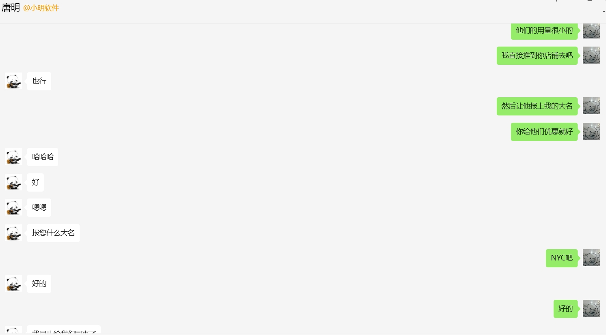
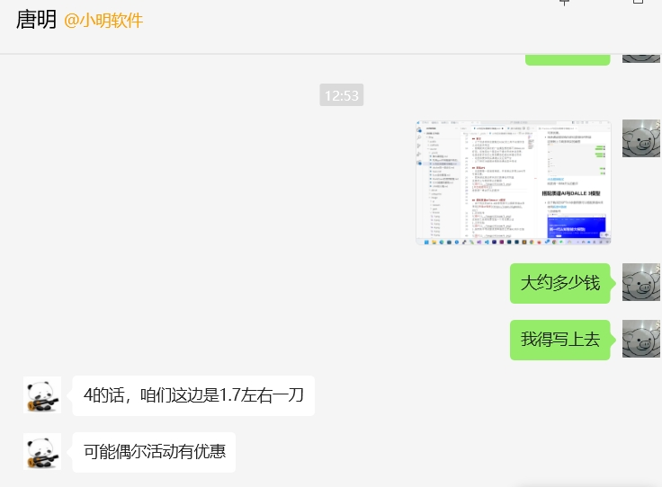
扫码进群即可购买

购买后将获得一串Sk开头的数字
这一串数字就是GPT4.0的API

## 搭配质谱AI与DALLE 3模型
- 由于购买的GPT4.0余额有限可以搭配质谱AI来使用[质谱AI链接](https://open.bigmodel.cn/)
1.注册账号
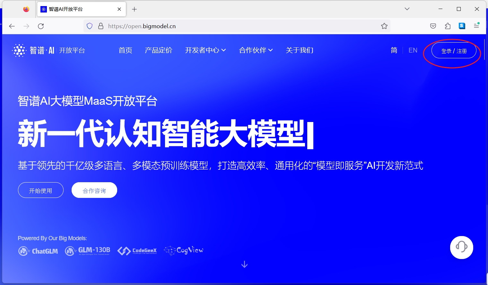
注册好之后将免费体验一个月无需认证
2.立即体验
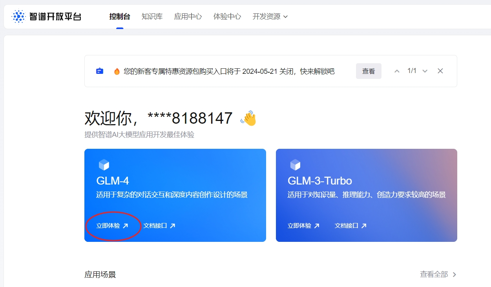
3.按照其中考试要求简单描述让质谱AI来补足细节
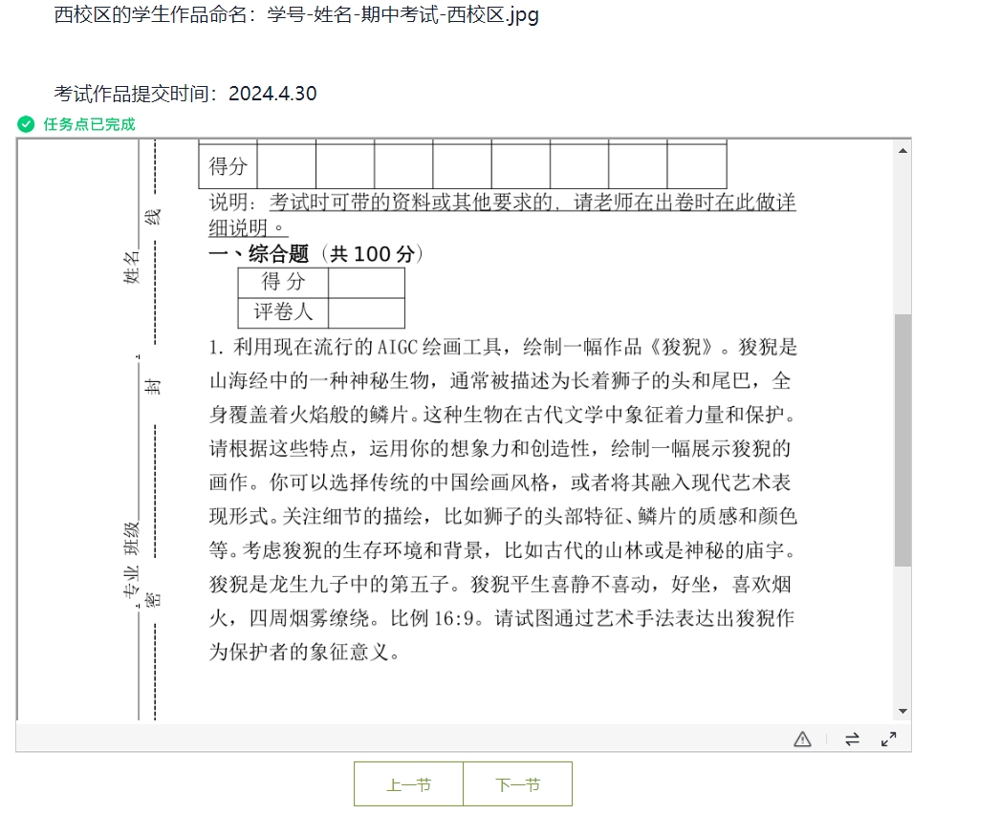
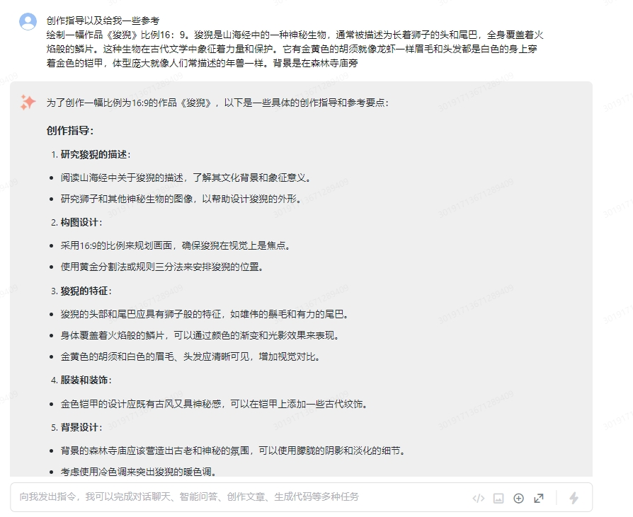
自己稍做修改
4.让质谱AI生成DALLE3指令
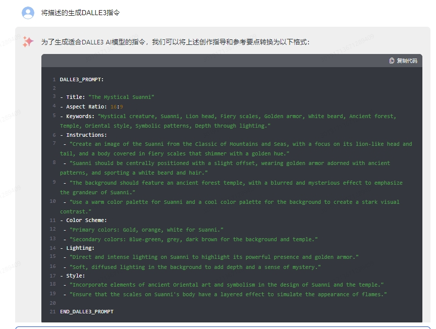
### 模型平台应用
1.复制这段指令到我提供的模型平台上
[点击访问Lobe平台](https://lobe.xiaoai.plus/)
[备用链接](http://info.stayrabbit.top:3210/)
2.点击设定
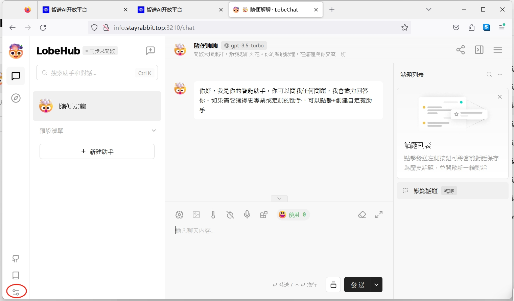
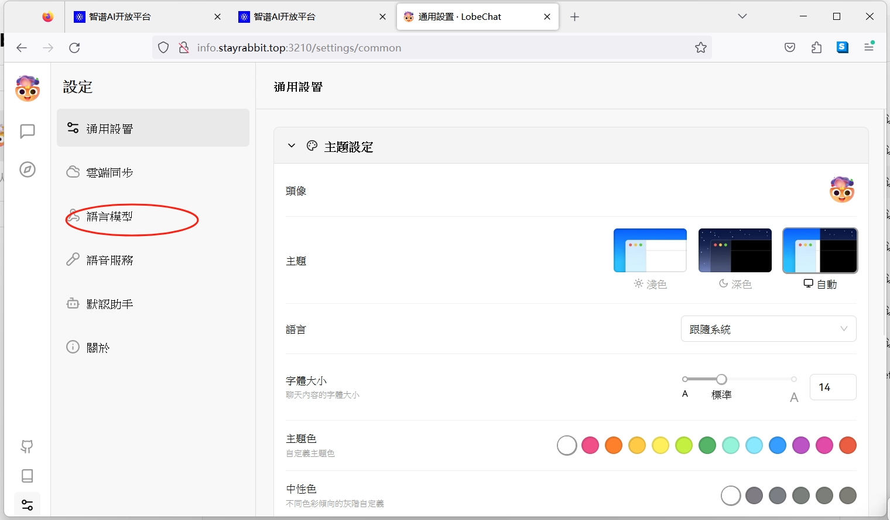
3.这里填入商家给你sk-xxx开头的APIkey
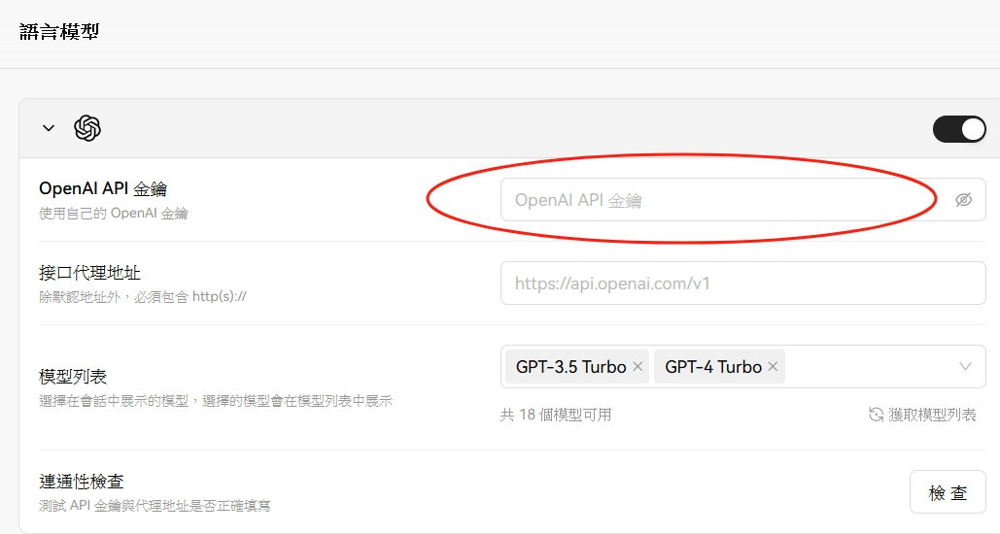
- 这里填入https://api.xiaoai.plus/v1
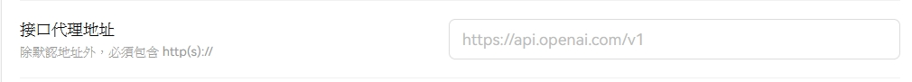
- 然后检查模型是否可用
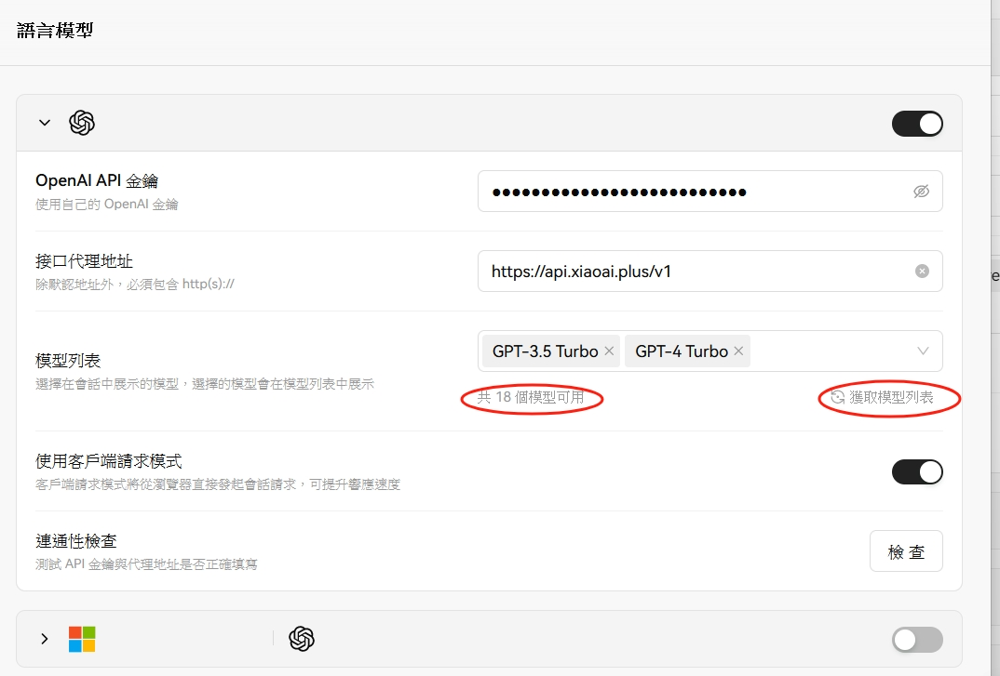
- 添加GPT-4-TurboPreview-1106
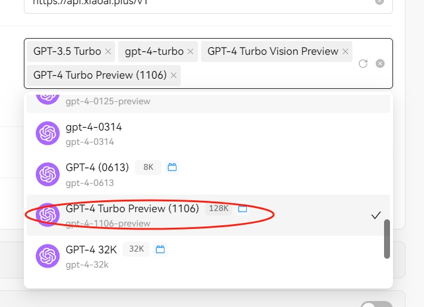
4.点击交互界面插件选择DALLE3和GPT-4-TurboPreview-1106
  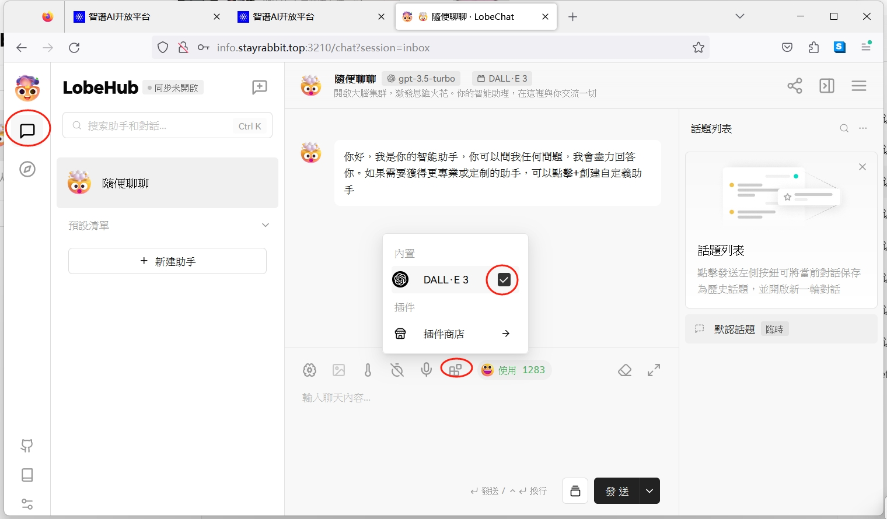
  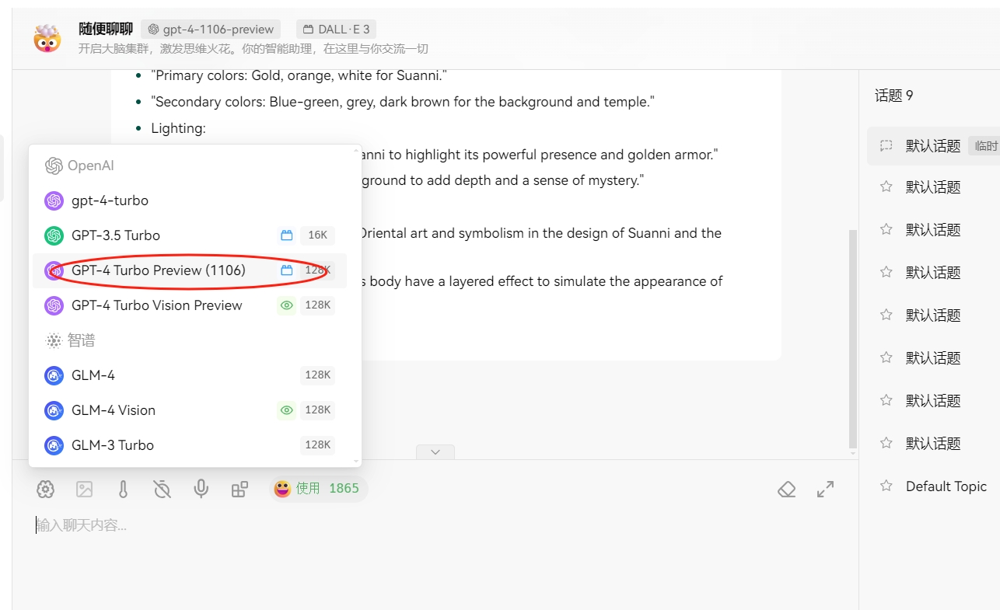
- 将质谱AI给的指令复制到对话框稍等片刻即可生成
### 大功告成！
将生成的图片保存完成考试吧！
  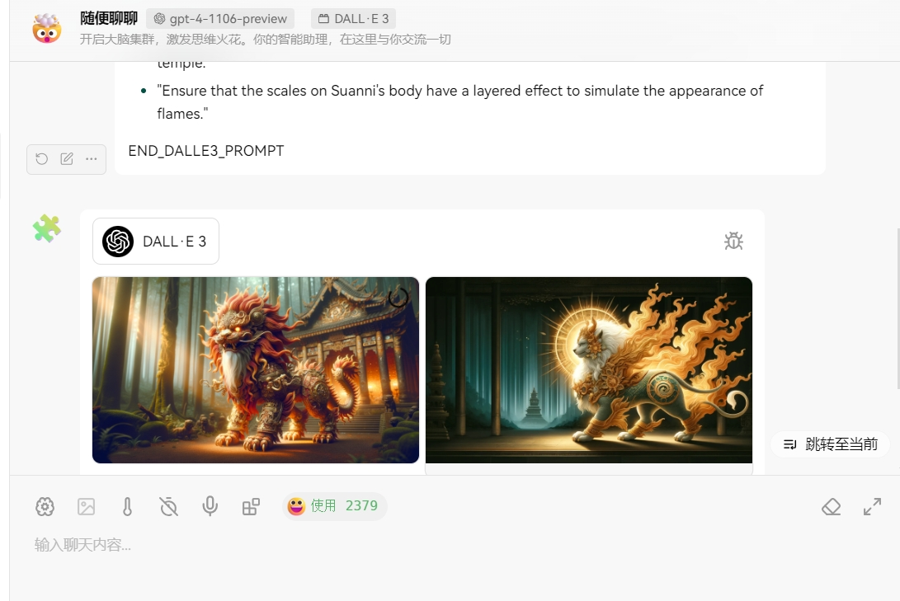