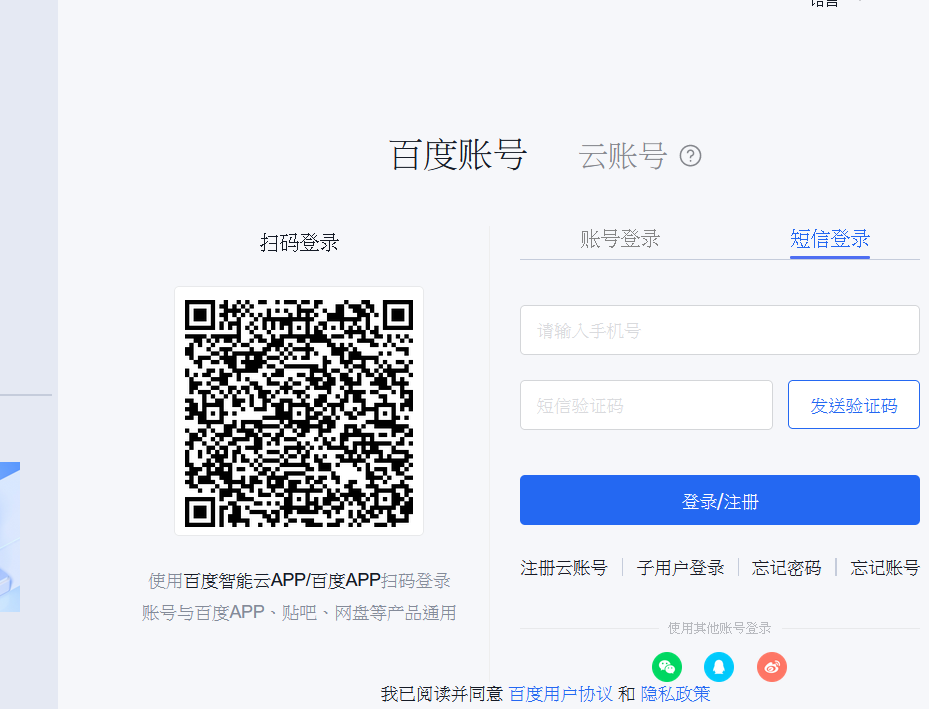
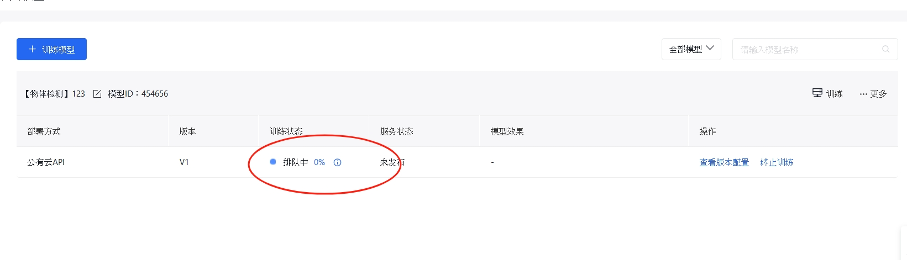

## 前言

- 在学习通上老师给的解析还不够详细仍然缺少了些细节

- 这里将一步步拆解老师给的解析
- 大家可以来使用我整理的数据集对于完成作业已经足够了    

## 步骤

- 打开[百度智能云网站](https://ai.baidu.com/easydl/)
点击【立即使用】在【在线使用】【图像:文心大模型】这一弹出【选择模型类型】，列选择【物体检测】

<!--more-->

- 有账号就直接登录无账号就注册

-点击训练模型

-填入个人信息其他复制粘贴就好

模型名称:输入【垃圾识别】
所属行业:【其他】
行业描述:垃圾分类
应用场景：【为批量图片自动打标签应用场景】
业务描述:【为了解决垃圾分类问题】

- 出现这个对话框不用理会直接点确定

- 这里勾选半监督按钮

- 点击创建数据集
  
- 填入名称

- 点击创建并导入

- 配置成图片一样的

可以上传我提供的素材
[下载](https://gitee.com/NYC1/temp/blob/master/%E7%AD%9B%E9%80%89.zip)

上传好了就确认

静静等待他导入好

- 导入好之后点击左边的在线标注

点击标注

点击添加标签逐次添加学习通要求的 餐巾纸、快餐盒、易拉罐、空的塑料袋以及满的垃圾袋进标签

点击左上的的图标画一个矩形把包含的物体到方框内然后选择对于的标签

每个都这样一个一个添加完之后

- 点击左侧的模型训练

选择已有模型

出现这个不用理会

注意：为了方便演示这里的标签是不完整的标签全选就好
按照图片配置如下：

- 训练环境按照照片配置

然后开始训练就好

- 静静等待他训练好大约要1.5个小时

- 训练完之后大概是这样的

## 检验
上传一张带你所训练的模型的图片来检验一下准确性

保存下面的图片去试试
