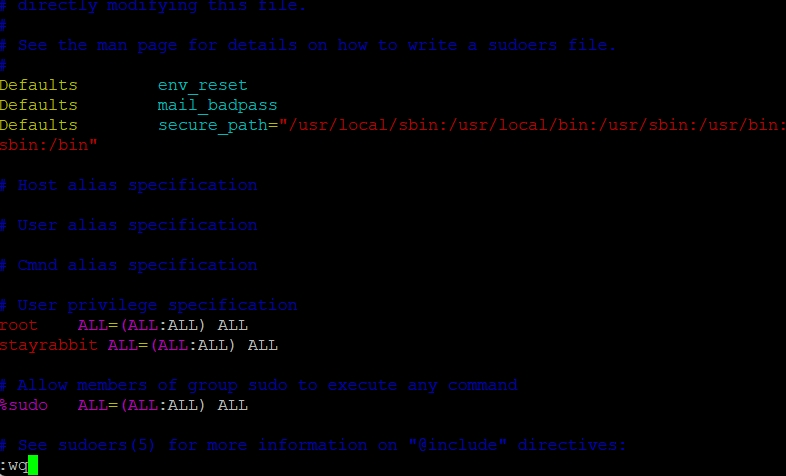
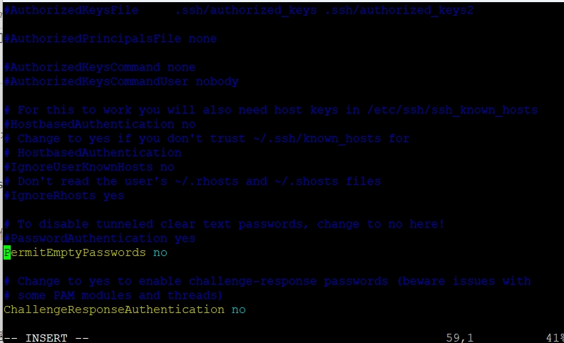
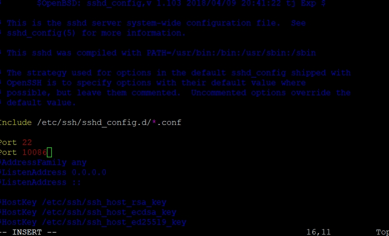
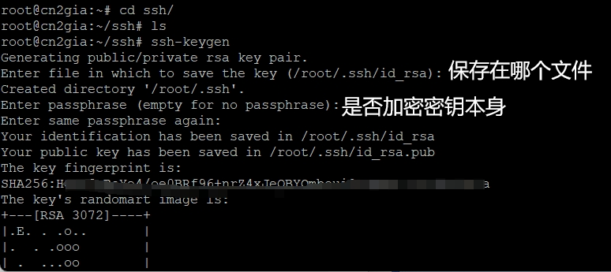
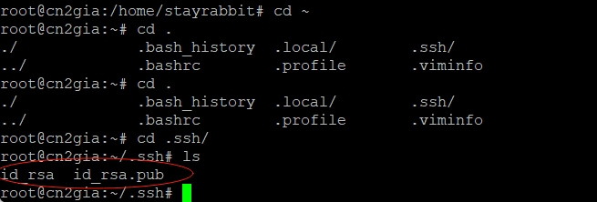
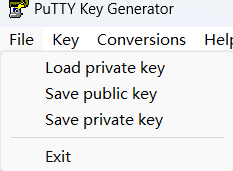
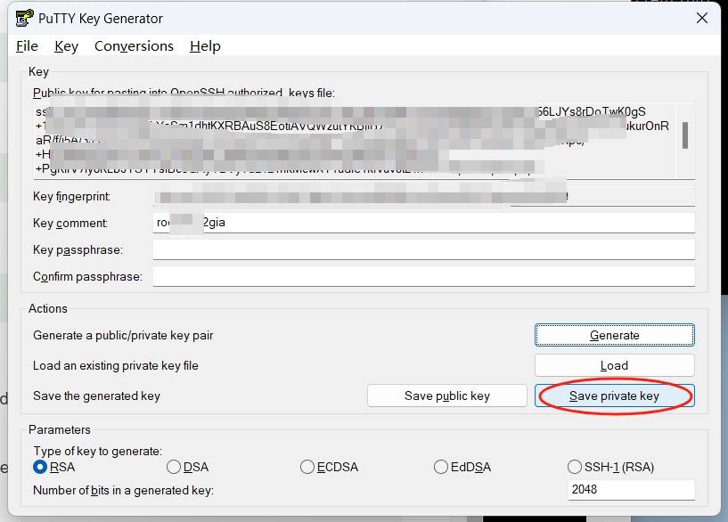
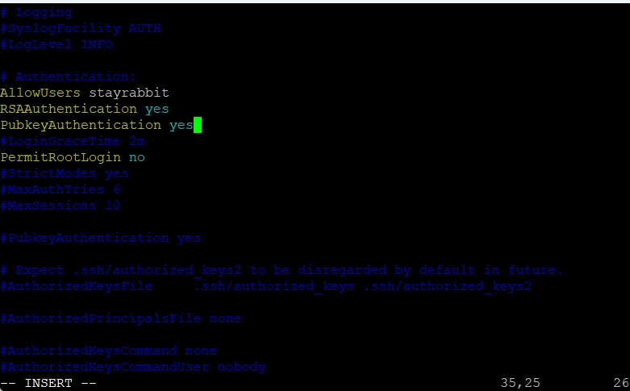
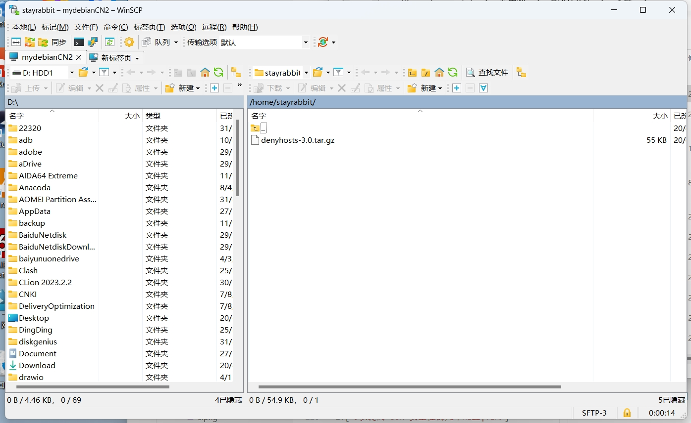

## 前言
- 介于上次被一个陌生的德国ip入侵之后不得已重置整个系统，所有已经部署的业务都得重来。由此可见做好安全管理多么重要！
- 以下一些常见的操作来增加系统安全防止被恶意入侵

## Linux安全管理之SSH安全
### 备份
- 记得备份好你的SSHD的配置文件以防万一
```bash
# cp /etc/ssh/sshd_config /etc/ssh/backup.sshd_config
```
### OpenSSH的路径
- OpenSSH 服务的配置文件路径为 /etc/ssh/sshd_config ，要配置它，必须得使用系统管理员（ root ）权限或使用 sudo 命令临时获得的管理员权限。
- 配置信息大概长这样的[链接](https://blog.nyc1.xyz/2024/03/18/SSHD%E9%85%8D%E7%BD%AE%E7%9A%84%E8%A7%A3%E9%87%8A/)
 
这里默认你已经会用编辑工具没有的话请安装VIM
```bash
# apt-get install vim
```
### 编辑配置文件
- 准备好就直接编辑
```bash
# vim /etc/ssh/sshd_config
```
<!--more-->

### 重载使新配置生效
当配置更改完成，重启 SSH 后台服务使新的配置生效。
```bash
sudo systemctl reload sshd
```
### 配置安全
### 1.禁用Root用户登录
#### 1.1添加其他用户
- 在此之前建议你先新增一个用户相关命令可以看[菜鸟教程中的useradd的命令](https://www.runoob.com/linux/linux-comm-useradd.html)
  ```bash
  useradd -m username //username指的是用户名
  ```
在刚刚创建的用户修改其密码
[passwd命令](https://www.runoob.com/linux/linux-comm-passwd.html)
```bash
passwd username
```
输入两遍密码后即成功修改

p.s.在添加用户的时候有些小问题例如切换用户不显示路径以及用户名可以查阅[这篇](https://www.shnne.com/post/510.html)
#### 1.2 Linux 安装以及配置Sudo
1.安装sudo
```bash
# apt-get install sudo
```
2.修改 /etc/sudoers 文件属性为可写
[chmod命令](https://www.runoob.com/linux/linux-comm-chmod.html)
```bash
# chmod u+w /etc/sudoers
```
3.编辑sudo配置文件
```bash
# vim /etc/sudoers
```
然后找到root ALL = (ALL) ALL这一行，在下一行加入username ALL = (ALL) ALL。username指代你想加入sudo组的用户名。

4.修改/etc/sudoers 文件属性为只读
```bash
# chmod u-w /etc/sudoers
```
第二种方法:
直接执行命令添加用户到 sudo
登录后复制
```bash
# usermod -a -G sudo stayrabbit    //注意改成你自己的用户名
```
#### 1.3修改SSH配置文件
- Linux 系统应该禁止 root 用户登录，因为这是有风险的，其不会留下审计信息。这就是 sudo 机制存在的原因。

如果系统添加了 sudo 用户，最好使用 sudo 用户通过 ssh 连接，而不是 root 用户。

要禁止 root 用户通过 ssh 访问，可以修改 PermitRootLogin 选项为 no：
```bash
# PermitRootLogin no
```
#### 2.禁用空密码
在 Linux 中，用户账户可以不设置任何密码（或者为空密码）。这些用户尝试使用 ssh，也不需要密码。

这是一个极大的安全隐患，我们应该禁止使用空密码。方法是在配置文件 /etc/ssh/sshd_config 中，将 PermitEmptyPasswords 选项配置为 no：
```bash
PermitEmptyPasswords no
```


#### 3.修改ssh的默认端口
ssh 的默认端口为 22，大多数攻击脚本都是围绕这个端口写的。更改这个默认端口会增加 ssh 的安全性，因为会极大的减少攻击者的数量。

在配置文件中搜索端口信息，并将其更改为其他值

请注意！在此之前先将对应端口防火墙打开
以防连接不上在默认的22基础上加上你刚刚添加的端口，用该端口连接上之后再将`Port 22`注释掉
可以参考这篇["iptables 禁止除22端口外其他所有端口"](https://blog.csdn.net/qq_44273583/article/details/116661747)

和这篇["iptables允许22端口访问"](https://juejin.cn/s/iptables%E5%85%81%E8%AE%B822%E7%AB%AF%E5%8F%A3%E8%AE%BF%E9%97%AE)
或者你觉得iptables麻烦可以参考我这篇[UFW防火墙](https://blog.nyc1.xyz/2024/03/18/UFW%E9%98%B2%E7%81%AB%E5%A2%99/)
用`netstat -antp`命令来检查开放的端口
```bash
Port 22
Port 10086
```
修改完成后需要记住你修改的端口（毕竟你还需要使用这个端口来登录的）

#### 4.禁用 ssh 协议 1
如果你使用的是比较旧的 Linux 版本，在某些低版本的 ssh 可能仍然有 ssh 协议 1 可用，该协议存在已知的漏洞，不能再使用。

较新版本的 ssh 会自动启用 ssh 协议 2，可以检查一下该配置：
```bash
# Protocol 2
```

#### 5.配置空闲超时间隔
空闲超时间隔是 ssh 连接可以在没有任何活动的情况下保持活动状态的时间。这种空闲会话也是一种安全风险，所以需要配置合适的空闲超时时间间隔。

超时间隔以秒为单位，默认值是0。我们可以将其更改为300，即保持 5 分钟的超时间隔。
```bash
ClientAliveInterval 300
```
在此间隔之后，ssh 服务器将向客户端发送一条活动消息。如果没有得到响应，连接将关闭，最终用户将注销。
还可以配置在断开连接之前，发送活动消息的次数：
```bash
ClientAliveCountMax 2
```
#### 6.禁用 X11 转发

X11 或 X 显示服务器是图形环境的基本框架。X11 转发允许您通过 ssh 使用 GUI 应用程序。

基本上，客户机在服务器上运行 GUI 应用程序，但由于 X11 转发，机器之间打开了一个通道，GUI 应用程序旧显示在了客户机上。

基于此，X11 协议是有安全隐患的。所以如果不需要它，应该禁用 ssh 中的 X11 转发。
```bash
X11Forwarding no
```
#### 7.用户白板
可以配置哪些用户允许通过 SSH 登录。这就是白板列表。仅白板列表里的用户可连接登录。白板之外的用户将被禁止  。来看下如何设置允许 `user` 用户通过 SSH 远程登录。 加入以下语句：
```bash
AllowUsers user
```
您想让谁 SSH 登录，别忘了加其用户名到 AllowUser（允许用户） 列表里。

---

### 用私钥连接登录SSH
1. 制作密钥对
首先在服务器上制作密钥对。首先用密码登录到你打算使用密钥登录的账户，然后执行以下命令：
```bash
ssh-keygen  //建立密钥对
```

现在，在 root 用户的家目录中生成了一个 .ssh 的隐藏目录，内含两个密钥文件。
id_rsa 为私钥，id_rsa.pub 为公钥


2. 在服务器上安装公钥
键入以下命令，在服务器上安装公钥：
```bash
#cd .ssh
#cat id_rsa.pub >> authorized_keys
```
如此便完成了公钥的安装。为了确保连接成功，请保证以下文件权限正确：
```bash
# chmod 600 authorized_keys
# chmod 700 ~/.ssh
```
3. 设置 SSH，打开密钥登录功能
编辑 `vim/etc/ssh/sshd_config` 文件，进行如下设置：

```bash
RSAAuthentication yes
PubkeyAuthentication yes
```
然后重启 SSH 服务：
```bash
# service sshd restart
```
4.将私钥下载下来利用winscp或者直接用`cat id_rsa` 复制下来
用PuTTYGen工具

选择Load Private Key将刚才复制下来的私钥加载进去
然后点保存

后续当你使用 PuTTY 登录时，可以在左侧的 Connection -> SSH -> Auth 中的 Private key file for authentication: 处选择你的私钥文件，然后即可登录了，过程中只需输入密钥锁码即可。
5. 保存好之后继续配置SSHD_config

当你完成全部设置，并以密钥方式登录成功后，再禁用密码登录：
```bash
PasswordAuthentication no
```
最后，重启 SSH 服务：
```bash
 service sshd restart
```

<!--
### denyhost服务
- DenyHosts是Python语言写的一个程序软件，运行于Linux上预防SSH暴力破解的，它会分析sshd的日志文件（/var/log/secure），当发现重复的攻击时就会记录IP到/etc/hosts.deny文件，从而达到自动屏IP的功能。
  
DenyHost[下载链接](https://sourceforge.net/projects/denyhosts/files/denyhosts/)
DenyHost的[Github](https://github.com/denyhosts/denyhosts)

#### 安装denyhost
下载好之后用winscp上传到服务器上


1.解压
[tar命令](https://www.runoob.com/linux/linux-comm-tar.html)
```bash
tar zxvf denyhosts-3.0.tar.gz
```
2.进入源文件目录
```bash
cd denyhosts-3.0
```
3.安装
```bash
python setup.py install
```
4.复制配置信息到`/etc`目录下
```bash
cp denyhosts.conf /etc
```
5.复制 daemon-control.dist
```bash
cp daemon-control-dist daemon-control
```
6.修改权限
```bash
# chown root daemon-control
# chmod 700 daemon-control
```

#### 配置denyhost
denyHost的配置文件路径在`/etc/denyhosts.conf`下
编辑配置文件
```bash
vim /etc/denyhosts.conf
```
配置文件的解释
```json
SECURE_LOG = /var/log/secure    # 监控的sshd日志文件，系统不同位置不同
HOSTS_DENY = /etc/hosts.deny    # 屏蔽IP的记录文件
PURGE_DENY = 7d                 # IP被屏蔽后，多久清除屏蔽记录(m-minutes,h-hours,d-days,w-weeks,y-years)
                                # PURGE_DENY =  设置为空代表永远不清除
PURGE_THRESHOLD = 3             # 某个host最多被清除的次数，如果清除次数超过这个值就不会再被清理了
 
BLOCK_SERVICE  = sshd           # 阻止的服务名，默认是sshd，也可以设置FTP、SMTP等
 
DENY_THRESHOLD_INVALID = 3      # 允许无效用户尝试失败次数(过了这个次数还是失败就加入屏蔽)
DENY_THRESHOLD_VALID = 3        # 有效用户(普通用户)尝试失败次数
DENY_THRESHOLD_ROOT = 3         # root用户尝试失败次数
DENY_THRESHOLD_RESTRICTED = 1   # 设定denyhosts将屏蔽host写入到/etc/hsots.deny文件中
WORK_DIR = /var/lib/denyhosts   # denyhosts工作数据目录
HOSTNAME_LOOKUP=YES             # 是否做域名反解
LOCK_FILE = /var/lock/subsys/denyhosts    # 将DenyHost启动的pid记录到LOCK_FILE中，已确保服务正确启动，防止同时启动多个服务
       ############ THESE SETTINGS ARE OPTIONAL ############
AGE_RESET_VALID=6h              # 普通有效用户登陆失败计数清零时间
AGE_RESET_ROOT=6h               # root用户登陆失败计数清零时间
AGE_RESET_RESTRICTED=25d        # /etc/hosts.deny文件清除数据时间
AGE_RESET_INVALID=1d            # 无效用户登陆失败计数清零时间
       ######### THESE SETTINGS ARE SPECIFIC TO DAEMON MODE  ##########
DAEMON_LOG = /var/log/denyhosts # denyhosts日志默认存放路径
DAEMON_SLEEP = 30s              # 当以后台方式运行时，每读一次日志文件的时间间隔
DAEMON_PURGE = 1h               # 当以后台方式运行时，清除机制在hosts.deny中终止就条目的时间间隔，这个会影响PURGE_DENY参数
```-->


## 参考

1.[如何配置安全的 SSH 服务？（OpenSSH 安全必知必会）](https://learnku.com/server/t/36120)
2.[可以提高 ssh 安全性的几个配置|TIAP](https://mp.weixin.qq.com/s/Qjx3dEHfTTzpXoBvJPcG3w)
3.[设置 SSH 通过密钥登录|runoob](https://www.runoob.com/w3cnote/set-ssh-login-key.html)
4.[SSH服务详解(二)--使用私钥登录 SSH 服务器(免密登录)|CSDN](https://blog.csdn.net/tyustli/article/details/122222605)
5.[DenyHosts 简单使用 |cnblog](https://www.cnblogs.com/suguangti/p/12952210.html)