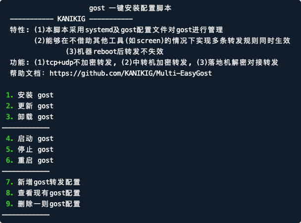
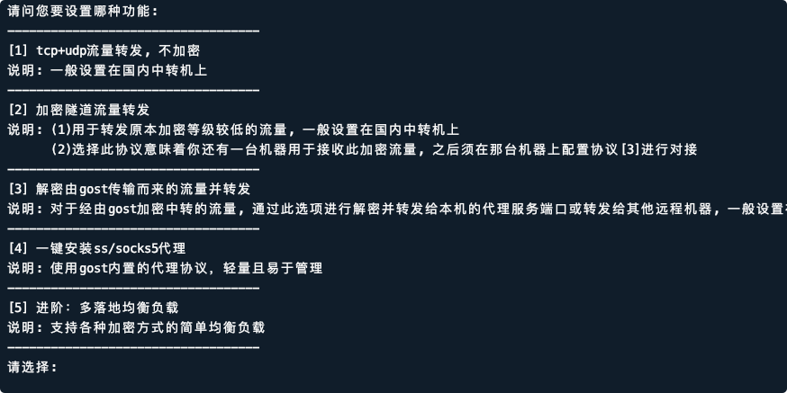
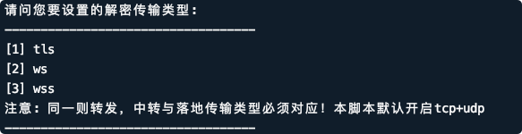
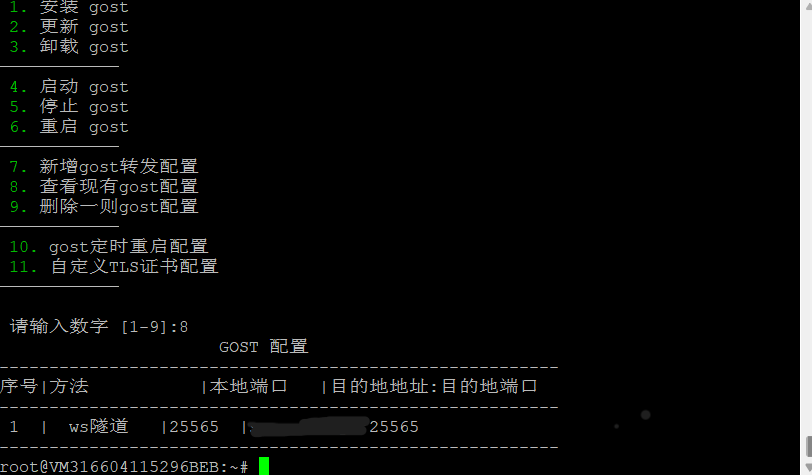
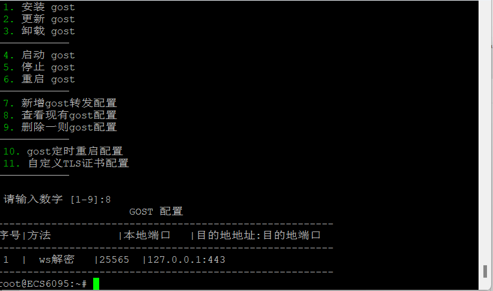

## 原脚本功能


- 实现了systemd及gost配置文件对gost进行管理
- 在不借助其他工具(如screen)的情况下实现多条转发规则同时生效
- 机器reboot后转发不失效
- 支持传输类型：
  - tcp+udp不加密转发
  - relay+tls加密

## 此脚本新增功能


- 增加了传输类型选择功能
- 新支持传输类型
  - relay+ws
  - relay+wss
- 落地机一键创建ss/socks5/http代理 (gost内置)
- 支持多传输类型的多落地简单型均衡负载
- ~~增加gost国内加速下载镜像~~（被恶意刷流量导致我损失，不再提供）
- 简单创建或删除gost定时重启任务
- 脚本自动检查更新
- 转发CDN自选节点ip
- 支持自定义tls证书，落地可一键申请证书，中转可开启证书校验

开源来自[KANIKIG/Multi-EasyGost](https://github.com/KANIKIG/Multi-EasyGost)
gost的脚本的安装命令

<!--more-->

## 中转机以及落地机部署环境
- Debian/Ubuntu 命令
```bash
# apt update -y # Debian/Ubuntu 命令
# apt install -y curl #Debian/Ubuntu 命令
# apt install -y socat #Debian/Ubuntu 命令
```
- CentOS 命令
```bash
# yum update -y #CentOS 命令
# yum install -y curl #CentOS 命令
# yum install -y socat #CentOS 命令
```

## 部署

- 所有落地机器跟中转机器都要安装且启动脚本

```bash
# wget --no-check-certificate -O gost.sh https://raw.githubusercontent.com/KANIKIG/Multi-EasyGost/master/gost.sh && chmod +x gost.sh && ./gost.s
```

- 再次运行本脚本只需要输入`./gost.sh`回车即可

- 
- 执行1即安装


## 中转机配置

以下仅供演示命令你也可以根据自己的需求使用它的功能
- 执行
```bash
# ./gost.sh
```
-   

选择7

- 在中转机当中需要将流量转发至落地机，所以我们这里一般选择2加密隧道流量转发


- 一般我们这里选择ws转发传输类型


- 根据安装提示配置本地端口&nbsp;(顾名思义本地上的端口指的是接收来自客户端流量的端口)
- 目标(落地机)&nbsp;&nbsp;ip地址:目标端口(落地机的ip地址，端口指的是将被转发流量的端口发送到落地机的接收端口)
  

## 落地机配置

- 同样在落地机上执行
```bash
# ./gost.sh
```  

- 
  

选择7
- 在落地机器中需要解密来自中转机的流量所以我们选择3


- 根据安装提示配置本地端口&nbsp;(指的是本地接收来自中转机的端口)
- 目标地址和端口:指向本地以及本地服务的端口


## 参考
- [KANIKIG/Multi-EasyGost](https://github.com/KANIKIG/Multi-EasyGost)