## 前言

很多同学都不知道教育邮箱、学信网认证有很多隐藏的福利可以省下很多钱，并且许多企业都有推行高校学生权益，你不单止可以免费使用正版软件，还可以以最优惠的价格购买他们的产品。就来让我打破你们的信息差吧！

<!--more-->

### 怎么申请教育邮箱？

1. 打开企业微信中的Workspace，选择一站式服务。
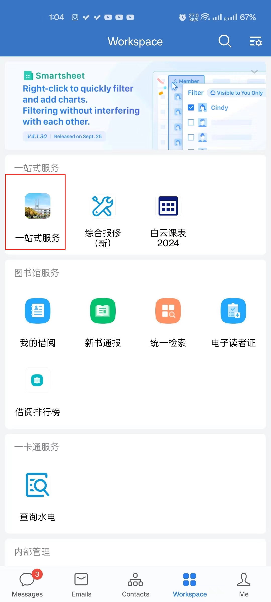
2. 选择学生服务中的邮箱开户
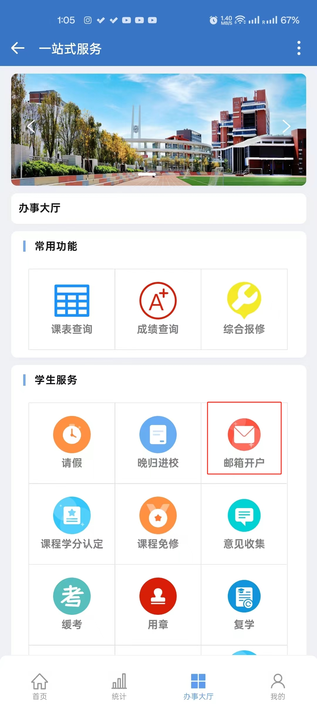
3. 点击左下角的事项办理
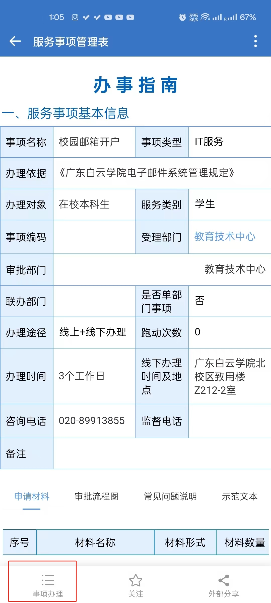
4. 填入相关信息
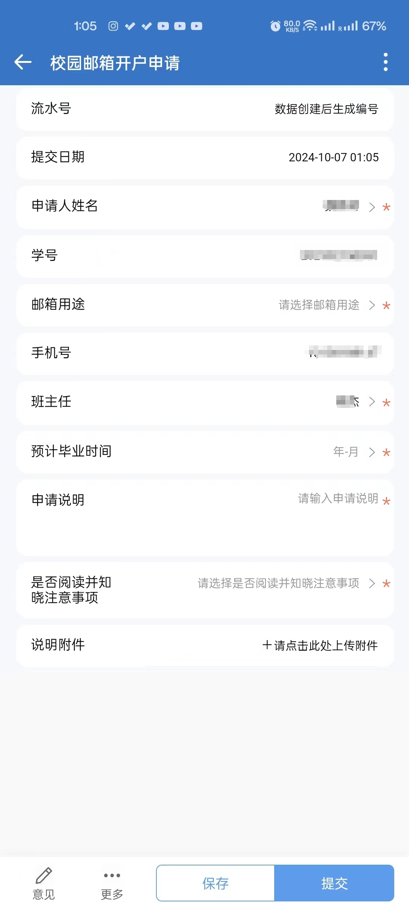

- 邮箱用途填学习需要
- 预计毕业时间按照你入学的年份往后推4年，月份填7月。
- 申请理由可以自定，我填的是`需要下载JetBrains全家桶学习用途`，你们可以仿造我这个写。
- 一般等待三个工作日即可。还有一点就是审批是需要你们辅导员同意的，你可以提前跟辅导员说明下，这样会快一些。
- 审批完成拿到邮箱账号和初始密码之后，去[163网易企业邮箱](https://qy.163.com/login/)去更改你的初始密码，随后可以在企业微信里面的邮箱去登录，这样看邮箱会方便一些。

### 怎么申请学习网验证报告？

- 根据[《白云学院学籍管理实施细则》](https://xxgk.baiyunu.edu.cn/html/cn/xsfw/405.html)规定
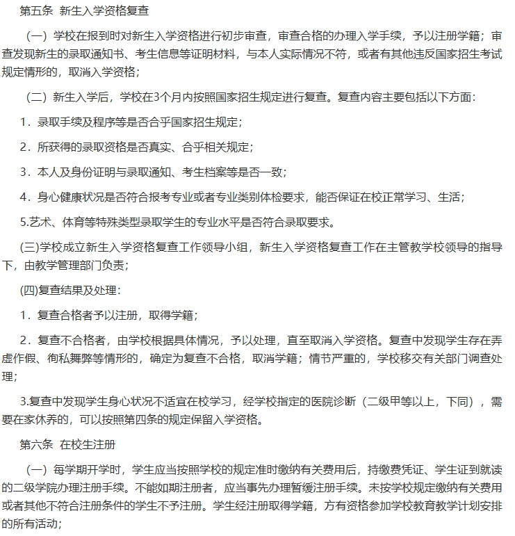
你们的学籍是需要被复查，复查后才准予注册取得学籍。
- 按照以往来看一般会在你们军训结束之后才会有学信网学籍，到时候你们要自己注册学信网来去核验自己的学籍信息。
- 关注微信公众号学信网或者上[学信网官网](https://www.chsi.com.cn/)
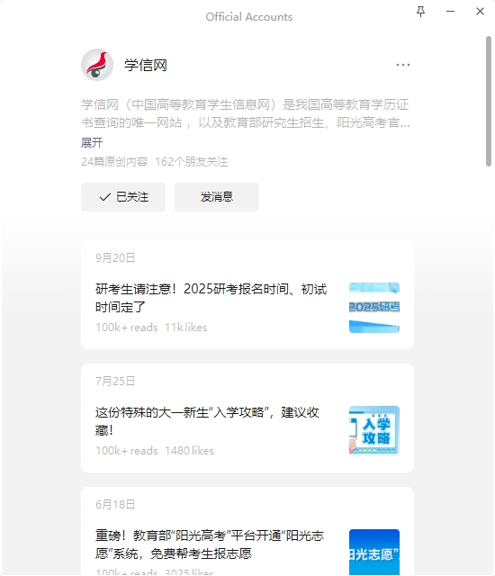
- 在下方栏在线服务，选择学信档案项
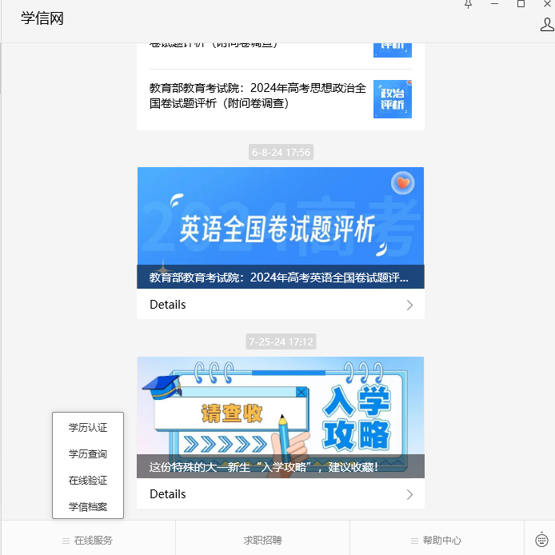
- 有账号的登录没账号的注册
- 在学信档案处点击自己的学信档案，下方有个申请验证报告
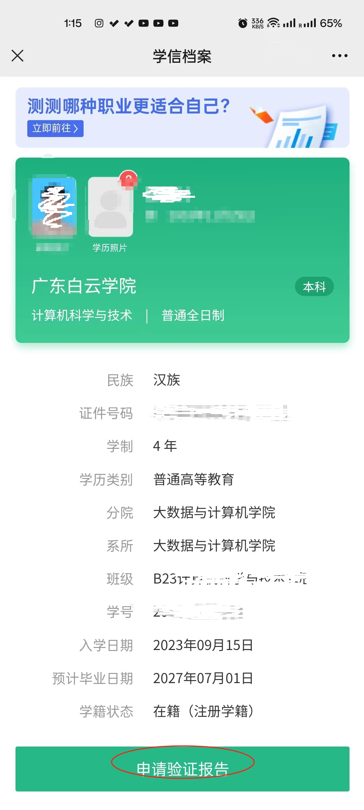

### 学哥正在薅的羊毛

- 拿到学信网学籍，拿到学校edu邮箱后请你们大大的使用，不要给他们赚了！

### 支付宝

- 在支付宝中搜索`学生认证`，点击第一个`支付宝学生验证`。
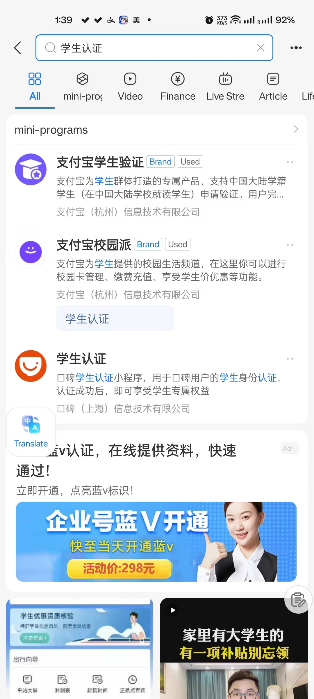

- 填入上面提到的申请的在线验证报告
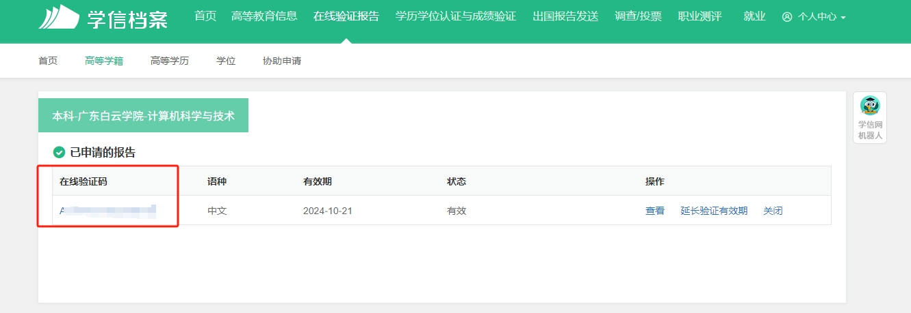

- 验证成功后你就可以看到这个界面
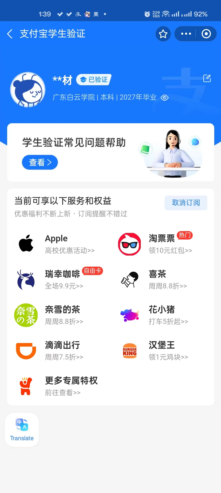

然后你们就可以开始薅支付的羊毛啦~

- 更多支付宝福利可以搜索`青春特权`。

#### 海底捞

验证好支付宝后还可以享受海底捞的学生优惠，详细可以在支付宝上搜索海底捞。
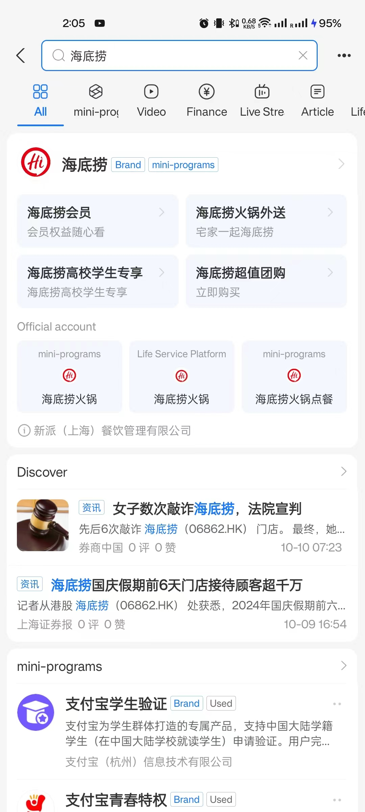

#### 麦当劳

还能享受麦当劳的学生福利每个星期都有不同券可以领，在支付宝上搜索麦当劳，点击麦当劳学生福利，认证学生身份即可领取。
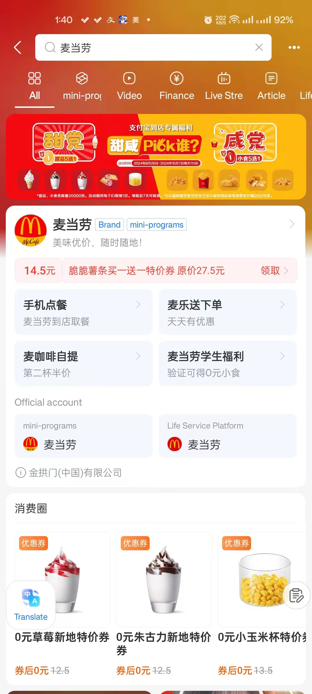

- 不仅如此学生购买O麦金会员有还能比大众版的要便宜3元。
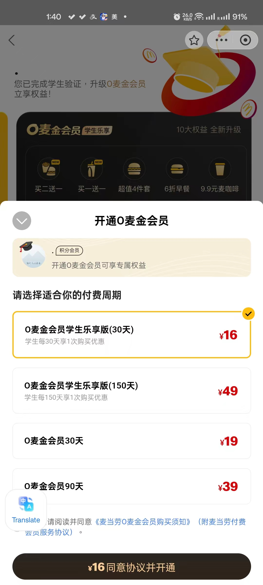

### 美团

- 大学生少不了什么，没错就是吃饭，美团也有对大学生的福利。
- 在主界面搜索`美团外卖学生版`，自动跳转到认证界面，根据提示进行认证。
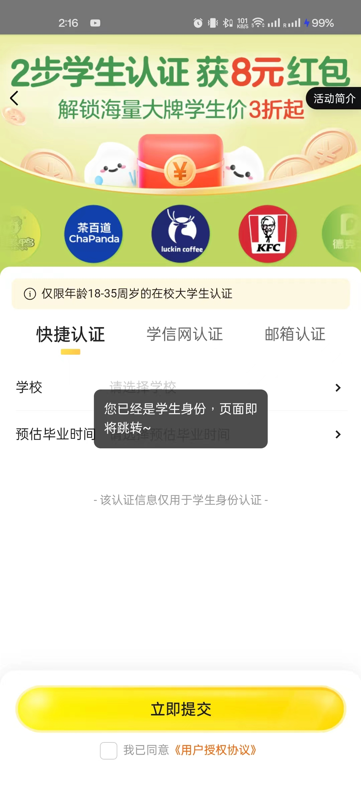
- 认证好之后记得打开学生版，在外卖界面中点击更多，点击学生版。

- 把学生版功能打开
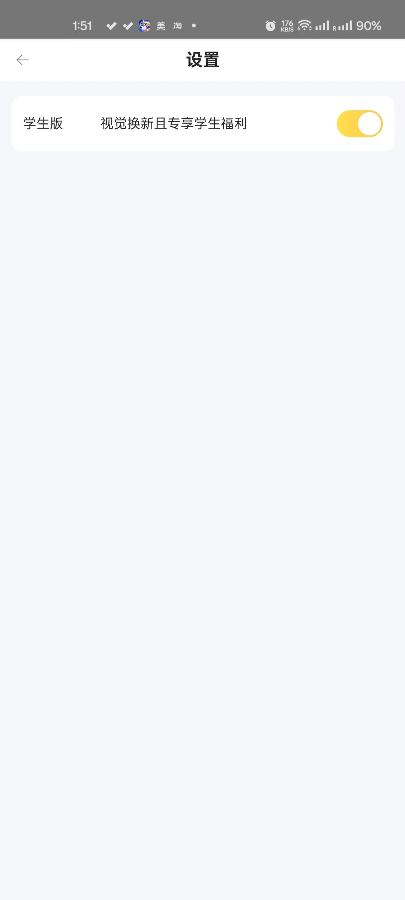
打开之后回到外卖界面，往上滑可以看到米粒，每天都可以通过米粒换取海量的美团卷。
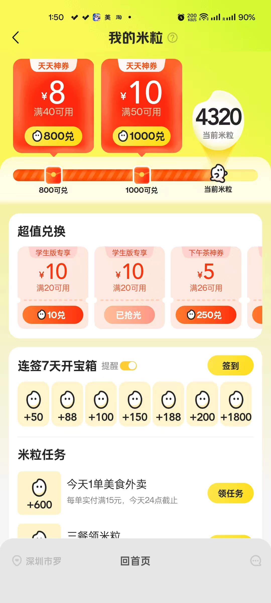

### Apple

TODO

#### apple music

TODO

### Microsoft
#### MS365
#### Onedrive

### Github学生包

作者：[西行妖](https://my.toho.red/)

如果你是计算机相关专业的学生，而你又申请了edu邮箱，那么你千万不能错过这项福利，因为你从这里能薅到的羊毛比本页面所有地方加起来还要多。不信？那么我来简单列一个表：

- 价值200USD的DigitalOcean、Azure云服务额度
- 价值8USD的.me域名
- 价值100USD的Github Copilot代码助手
- 价值399USD的Unity Pro订阅
- 价值149USD的Jetbrains全家桶

这还只是一小部分，里面还有很多计算机专业学生必不可少的福利没有列出来，但光是这些应该足够让你心动了。那么心动不如行动，下面开始进行申请教程：

1. 打开[education.github.com](https://education.github.com)，点击Join Github Education进入申请页面。

2. 拉到最下面，输入Guangdong Baiyun University进行搜索，如果你的GitHub账号没有绑定你的edu邮箱，就会提示你进行绑定验证，点击Add a email address进行添加。
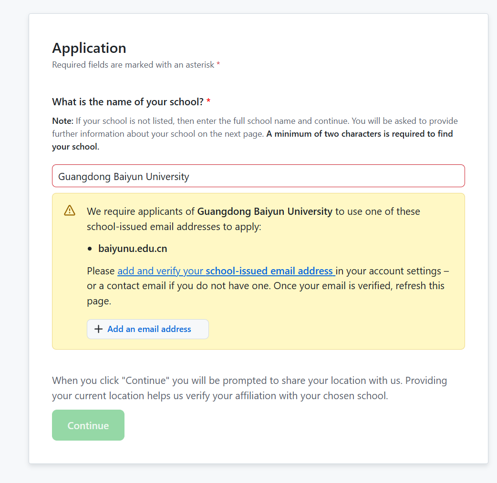

3. 在下面的Add email address输入你的edu邮箱，并根据指示进行验证。

4. 验证成功，再回到这个页面就会发现Continue按键绿了，点击即可进入填表页面，如实填写就行。  

**这里有一个坑要注意，在填这个表时必须关闭一切代理，否则会直接以spambot为理由拒绝你的这次申请。**

在填完表后点击提交，如果一切顺利的话几分钟后就会收到邮件提醒你申请成功。

5. Enojy yourself :)
