## 前言
- 介于我在国庆回家的路上在想着怎么样才能让自己的社团成员学习到维修的一些知识呢，我想到了写一篇blog来教你们如何快速的入门。
- 作为24届白云学院计协维修部的副部长，具备扎实的电脑维修知识和实践能力是作为维修部成员是必备的素质。我希望这一篇指南可以传承下去让白云学院每一届的维修部的同学都有所受益。
- 本指南将从电脑的基础知识入手，详细介绍电脑各个部件的功能与作用，并通过实践拆装电脑、清灰等操作，让大家亲自动手，掌握实用的维修技巧，我们还将深入讲解BIOS的基本概念和常用设置，以及如何重装系统等高级操作。
- 此篇适用于广东白云学院计算机协会维修部或者其他部门的每一个成员，以及为有兴趣的同学提供学习指南。

<!--more-->

#### 计算机协会维修部介绍
- 关于维修部的官方宣传图

#### 加入社团你可以获得什么？
- 问到这个问题之前也可以问问你自己加入社团的初衷是什么。
- 在面试的过程当中我也有随机问想加入计协的同学，有些人回答加入社团可以让你的大学更加完整更加的有仪式感，有些人回答可以跟师兄师姐学习计算机的知识，可以跟着师兄师姐做项目和竞赛（~~我很菜我没竞赛经验哭哭~~）等等很多各种各样的回答。
- 那么以我为例子学哥在经历一年的大学社团学到了什么获得了什么？
  - **拓展自己的人脉**：我认识了各个专业不同的人，当然也认识了很多师兄师姐。
  - **个人素质的提升**：在部门参与了教学培训工作，增强我的责任感和自信心培养了我的领导能力和口才能力。
  - **交流的平台**：与同届和师兄师姐分享学习经验心得，拓展自己的视野，共同进步。
  - **帮助他人**：加入社团之后我能帮助到更多的人，我首先是个非常乐于助人的人。在读大学之前也有很多人帮助过我，不至于处处碰壁。我认为这种美德就应该回馈跟传承下去，如果每个人都喜欢白嫖，那么不会有下一个人捞我一把，这就是我的信仰。如果你觉得你也很感谢别人帮助你那么请帮助下一个需要被帮助的人，让这种美德不断地传递下去。
- 我认为现在的知识变得越来越廉价，你想要学习什么想要知道什么一问百度一问chatgpt就可以很轻松地获得答案，所以加入社团最重要的不是知识本身，而是你在跟别人交际的时候学习到的一些人情世故，是听不同的人的不同的故事和经验，是你所能交到的朋友，这些无疑是比知识更宝贵的。
- 无论你加入社团的目的是什么，请记住他并且坚持下去。

## 电脑硬件的基本组成--如何看懂电脑的性能参数
- 这里不会过多的去描述各种各样的原理，这些你们上课会学到。
  而这里会更多的去让你拓展课上老师不会教你的东西，例如CPU（中央处理器），GPU（图形处理器）、RAM（内存条）这些型号为什么这样命名、Intel和AMD怎么去做对比，内存条中的DDR4、DDR5是啥等等会在以下介绍。

### 水桶效应

- 这里要给同学先引入一个概念called`水桶效应`或者称`短板效应`，那么就是你能装的水取决于你木桶的最低处，在计算机性能、网络性能就如同木桶里的水一般等等都能应用到这个概念。

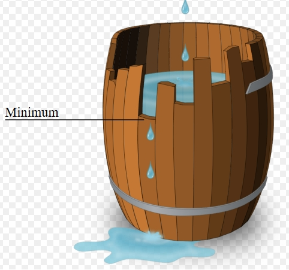

- 对于计算机性能取决于你的最短板，例如说你的固态硬盘M.2 SSD NVME是需要跑到`PCIE4.0`通道才能发挥出它的所有性能，但是你的主板只支持`PCIE3.0`，那么你的固态硬盘的性能就会被主板这个短板所限制住。

- 对于网络而言，你的所有交换机、光猫、路由器都是千兆级别的，但是由于你用的网线是百兆的，所以你的短板是在网线上你最大的速率就只能被限制在百兆的环境中。

---

### 中央处理器（CPU）

- CPU是电脑的核心，CPU不仅仅是做运算它还控制着电脑各个硬件资源的调度，一个CPU的好坏，直接影响计算机性能的高低。
  
 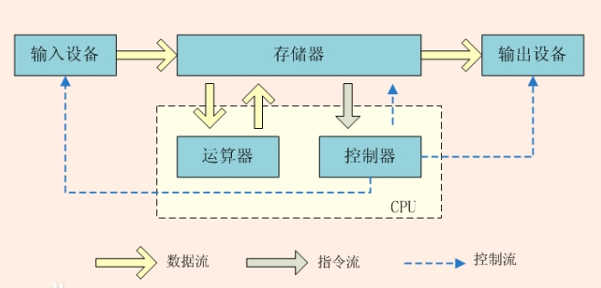

- 一般长这样
  
 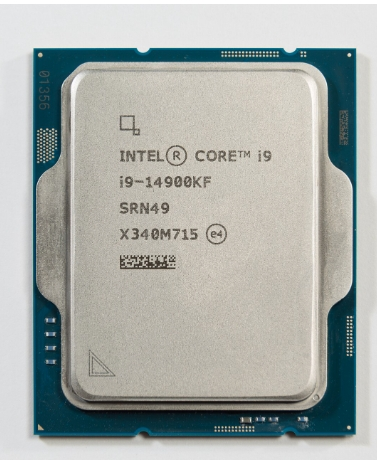

- 要想了解CPU的性能参数有哪些，我们可以下载[CPU-Z](https://www.cpuid.com/softwares/cpu-z.html)来查询自己的CPU型号来一览CPU的性能参数，不仅如此用这个工具还可以查询到主板、内存、SPD(可以看内存的一些预设以及插槽)、显卡还能用这个软件做一些简单的跑分来对比同型号的性能差异来检测出你这台电脑CPU性能的释放是否正常。

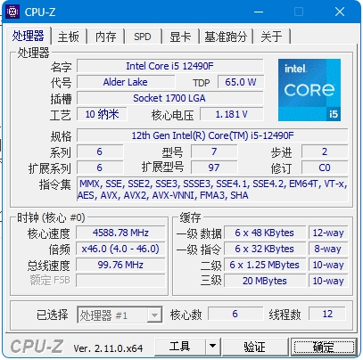

#### CPU的命名规则-Intel
- 很多同学还认为i9一定比i7强，i3一定就比i5弱这种概念。其实不然i3未必就比i5弱以`i3-12100`与`i5-8400`对比为例子在`Cinebench R23`上的跑分

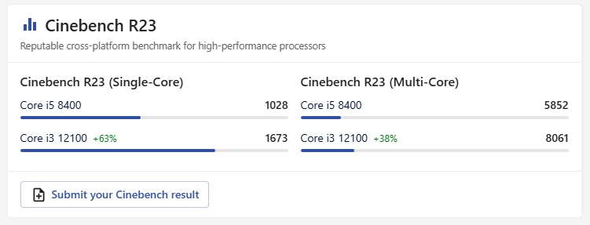
快来对比以下你们手上的CPU比例子中`i3-12100`强多少[对比网站](https://nanoreview.net/en/cpu-list/cinebench-scores),当然你们也可以自己下载[Cinebench R23](https://apps.microsoft.com/detail/9pgzkjc81q7j?hl=zh-tw&gl=CN)来测试自己电脑CPU的性能，我推荐你们使用Cinebench来测试性能而不是鲁大师因为我认为鲁大师是款流氓软件对你系统的环境很不友好并且鲁大师算法及其不稳定没有太多的参考意义，所以网友都称它为娱乐大师。

- 从跑分可以看出来这款`i3-12100`的CPU型号不论单核性能还是多核性能都明显优于`i5-8400`反应出i3未必比i5弱，所以i3-i5-i7-i9其实不是判断性能的唯一标准，要想知道CPU某一款的性能是否要比另一款要好，我们就得来研究CPU的命名规则。
  
##### 产品线

以我的电脑为例子全称为`Intel Core i5 processor 12490F`
- Intel表示的是品牌通常我们直接忽略掉。
- Core 表示的是产品线名字，代表了不同的产品线定位除了Core以外还有像是`Celeron（赛扬）`、`Pentium（奔腾）`、`Core（酷睿）`、`Xeon（至强）`。

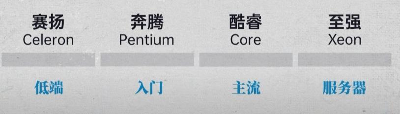

在同一时期下他们之间的性能：`Celeron（赛扬）` < `Pentium（奔腾）`< `Core（酷睿）` < `Xeon（至强）`

- 其中`Core`酷睿是消费级当中最为主流的也是最为常见的。

---

##### 系列

到了我们喜闻乐见的i3-i5-i7-i9，它所指的并不是具体的某个产品而是一个系列。
- i3表示低端产品
- i5表示中端
- i7表示高端产品
- i9就是最强的旗舰级产品
  
 单纯从i3-i5等这么去看很显然跟我们之前的[对比](#CPU的命名规则-Intel)不符合，当然这个是需要一个前提那么就是在相同的时间维度上才成立，他需要与代数来综合判断整体的性能，那么怎么看呢？

- 我们可以看到`12490F` 看到四位数字的前两位`12`代表着是12代Core（酷睿）当然同一代也衍生出不同的系列例如`i7-12700`、`i9-12900K`等等，他们是同一代的情况下那么拿i3-i5-i7-i9来对比就成立。
- 最早的一代的命名`i5-750`，第二代就是`i5-2XXX`从第二代开始的第一个数字就代表了第几代，同理第九代的就形如`i5-9xxx`，到了第十代开始就变成了前两位数字以十三代为例`i7-13700K`这样以此类推。

  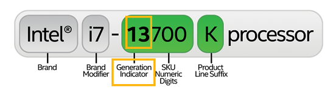

- 所以同样是i7不同的代数，性能相差的不是一点两点而是十万八千里。

 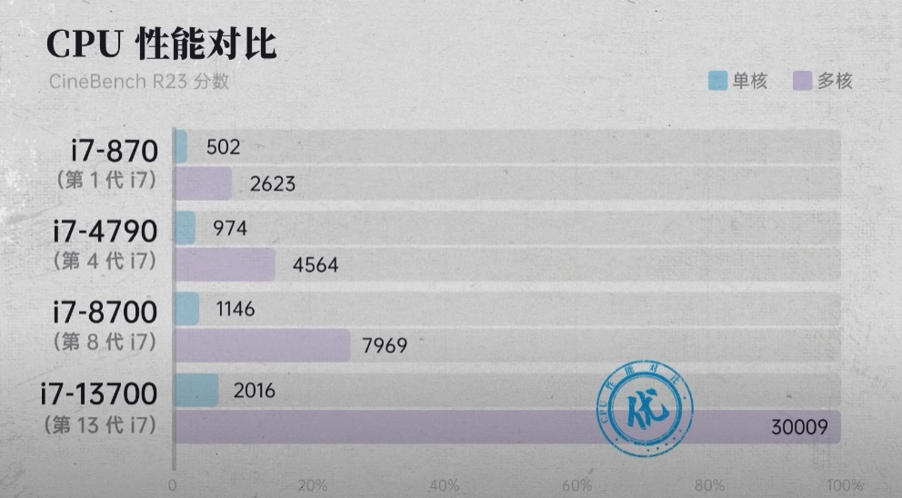

 ---
##### 子型号

- `i5-12490F`十二代数完之后的数字`490`就是子型号。

以i5-十二代为例有区分诸多的子型号。

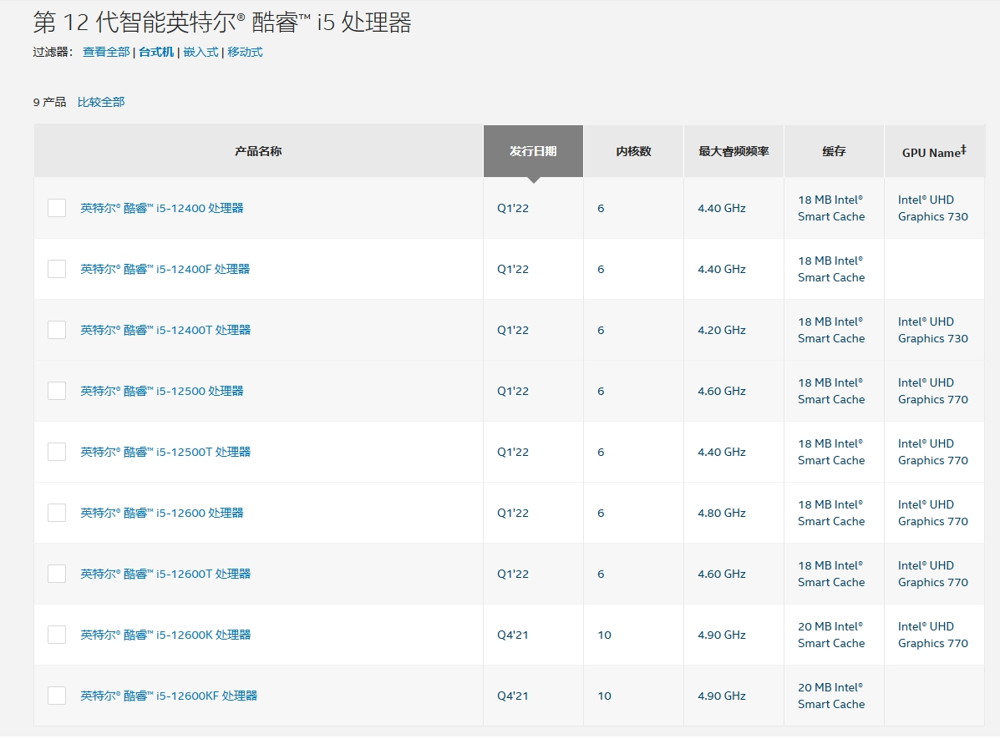

通常情况下数值越高性能越强，价格也就更贵一些。

- 以`i5-12400`对比`i5-12600K`为例:

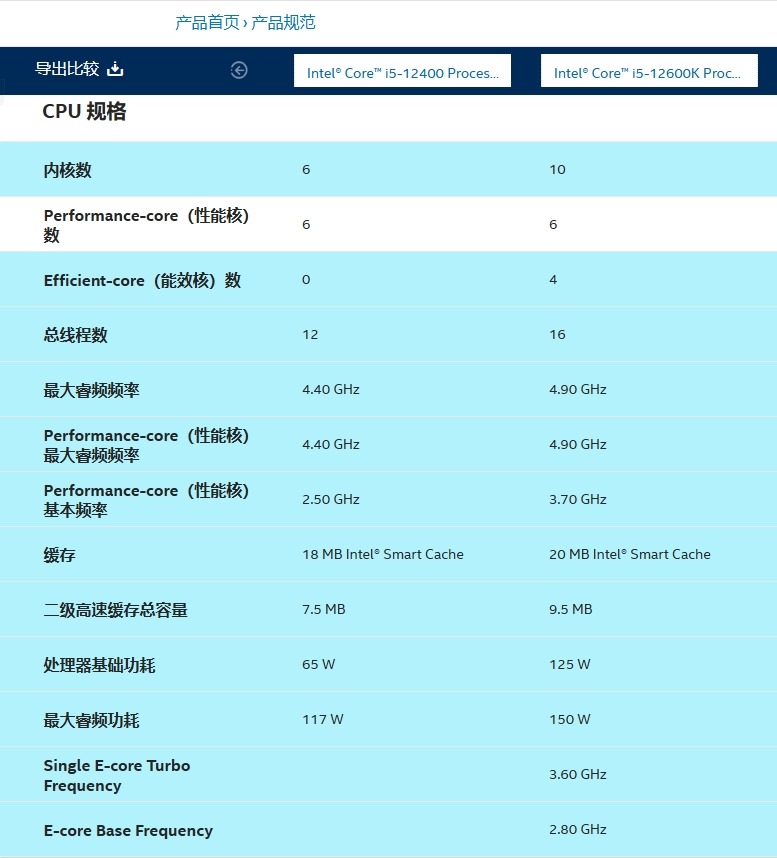

相对于`12400`而言，基础频率以及最大[睿频](https://www.intel.cn/content/www/cn/zh/gaming/resources/turbo-boost.html)（Turbo类似于Intel的自动超频,可以在安全温度和功率限制内，将CPU频率提升）都有所提升，核心数增加了4个，还引入了E核（Efficient-core）和P核（Performance-core）的技术，L2和L3缓存都略有升级。

- 当然还有核显上的提升，关于显卡的性能后面会再介绍。

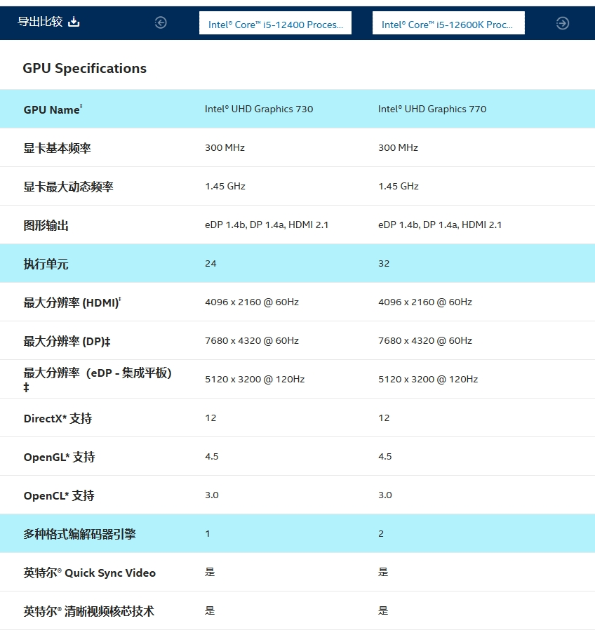

以上就是不同子型号所带来的性能差异，但是获得性能是有代价第一点就反应在价格上，其次对于CPU的供电、功耗也会有相应的要求，后续也会介绍到不同定位的主板对于CPU等供电的差别。

---

##### 后缀

- 像是`12600K`的`K`是啥意思，`F`又是啥意思。
- 而后缀在台式机上用的CPU与笔记本上的CPU上有所差别。

| 桌面端 | 后缀 | 解释 |
| :----: | :----:  |:----:|
|      | 无后缀的标准版 | 带核显锁倍频 |
|      | K | 解锁倍频，支持超频可以通过与超频主板的配合超频，提升电脑性能 |
|      | F | 无核显，需要搭配独立显卡才能使用，没有带K就表示锁倍频 |
|      | KF | 与上一个相同，无核显，但是解锁倍频可以超频 |
|      | T | 低功耗节能版，但作为代价CPU的性能会打折扣 |
|      | X/XE | 最高性能，通常是工作站级别的，价格也是较贵的 |
|      | S | 特别版 |

| 移动端 | 后缀 | 解释 |
| :----: | :----:  |:----:|
|      | H | 标准电压的移动端CPU，一般对比桌面端阉割系数较小 |
|      | U | 低电压，低功耗，性能较低，发热小 |
|      | Y | 比U功耗更低的移动端CPU |
|      | HK | 标准电压，不锁倍频可以玩超频的移动端CPU |
|      | P |    针对轻薄型笔记本电脑进行性能优化    |
|      | G1-G7 | 显卡级别（采用较新集成显卡技术的处理器） |

除了这些还有更多的后缀详细可以参考[Intel官网的后缀介绍](https://www.intel.cn/content/www/cn/zh/processors/processor-numbers.html)，这里只介绍常见常用的。

##### Intel新命名方式-十四代之后

- 与上述讲述的命名方式不同的是，Intel从十四代之后更换了它的命名规则，Intel会保留Core酷睿，但i9、i7、i5、i3之类的分类会被Ultra+数字取代，命名会变成酷睿Ultra+数字来区分。其他命名逻辑与之前类似。

旧命名：
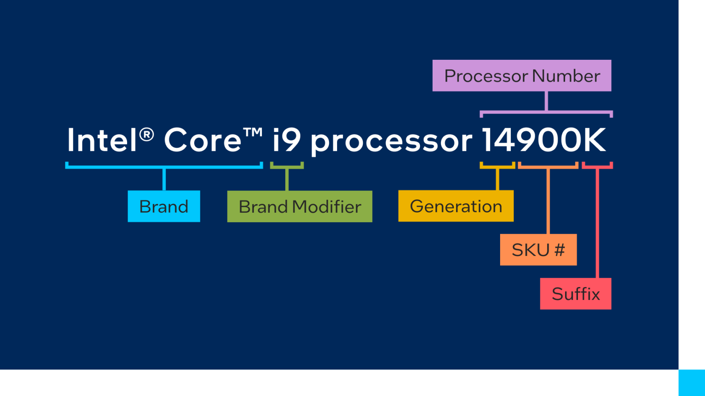

新命名：
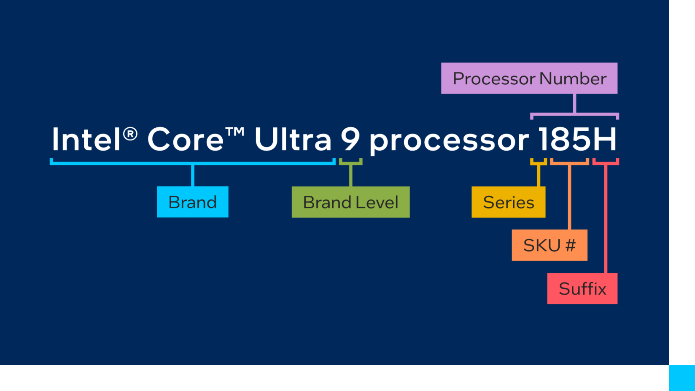

##### 关于CPU命名的拓展学习

[【硬核科普】CPU是如何命名的，数字更大就一定更好吗]( https://www.bilibili.com/video/BV17u4y1979X/?share_source=copy_web&vd_source=141efb301e87945ebfb614f57c347f88)

<iframe src="//player.bilibili.com/player.html?isOutside=true&aid=829814964&bvid=BV17u4y1979X&cid=1236137266&p=1&autoplay=0" scrolling="no" border="0" frameborder="no" framespacing="0" allowfullscreen="true"></iframe>

---

#### CPU的性能指标

- **核心数（Cores）**：Intel CPU的核心数从双核到多核不等，高端产品如Core i9系列可达10核以上。核心数越多，处理多任务的能力越强。
- 
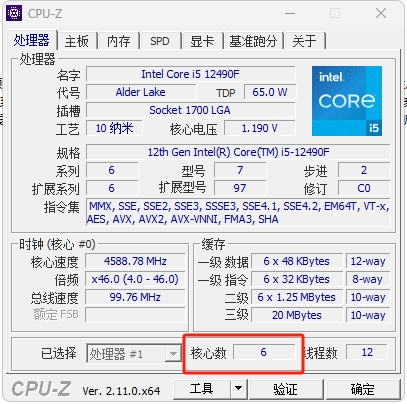

- **主频（Clock Speed）**：CPU的主频=外频x倍频。CPU的默认运行频率，单位为GHz，越高越性能越强但同时需要更高的电压去推动，一些超频玩家也是超这个来提升CPU的性能

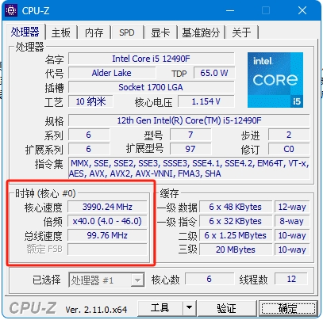

- **线程数（Threads）**：线程是CPU执行任务的基本单位。一些CPU支持超线程技术，可以模拟出比核心数更多的线程，提高并行处理能力。
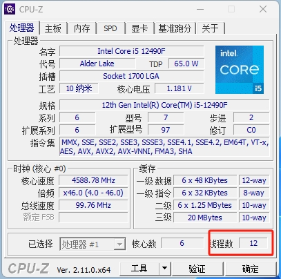

- **架构**：越新的架构对[IPC](https://www.cnblogs.com/liujiaxin2018/p/16534744.html)的性能就越好，IPC性能可以理解为这颗CPU最最基础的计算能力，也有例子表示在同频率同核心的情况下架构的优化会直接影响IPC性能。

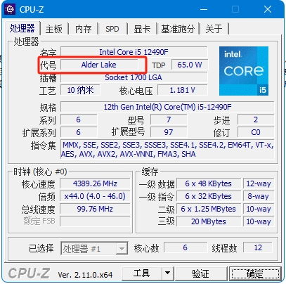

- **缓存（Cache）**：CPU缓存是位于CPU内部的高速存储器，用于存储频繁访问的数据和指令。缓存分为L1、L2和L3级别。级别越低越接近CPU，速度越快，同时成本越高。

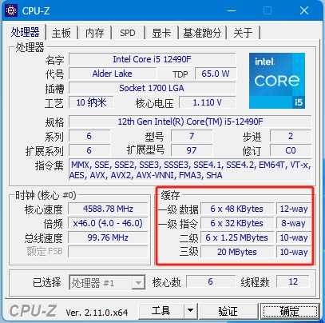

- **制程工艺（Process Technology）**：制程工艺是指制造CPU时使用的半导体工艺技术，通常以纳米（nm）为单位。制程工艺越先进，CPU的性能和能效通常越好。

- **TDP（Thermal Design Power）**：TDP是指CPU在最大负载下的热量设计功耗，以瓦特（W）为单位。TDP越低，CPU的发热量越小，散热要求也越低。
- ##### 关于TDP的拓展学习
  - 【【硬核科普】CPU和显卡的TDP指的是什么？和功耗是什么关系？】 https://www.bilibili.com/video/BV12L411976B/?share_source=copy_web&vd_source=141efb301e87945ebfb614f57c347f88
  - <iframe src="//player.bilibili.com/player.html?isOutside=true&aid=438970756&bvid=BV12L411976B&cid=1072646531&p=1&autoplay=0" scrolling="no" border="0" frameborder="no" framespacing="0" allowfullscreen="true"></iframe>
  
#### CPU的选择和对比--天梯图

看到这里对CPU的性能介绍有个基本的了解，但是刚开始接触难免会没有什么概念，那么要怎么才能快速的知道CPU性能在哪个档次呢？AMD与Intel同价位下的性能差多少呢？  
    
- 我们可以借助CPU天梯图来快速了解CPU的性能
    - [桌面端CPU天梯图](https://www.mydrivers.com/zhuanti/tianti/cpu/index.html) 
    - [笔记本端CPU天梯图](https://www.mydrivers.com/zhuanti/tianti/cpum/index.html)
  
或者你平常打游戏也可以直接上B站搜这款CPU在你玩的游戏里面多少帧率（不玩游戏的同学也可以用主流游戏的帧率来对比性能）。

#### 市场上充斥着各种各样的CPU买哪一个好呢？-选购建议
由于电脑市场上的快速换代每次研究都要花费很多时间，为了快速了解到市场的行情我推荐你们可以关注微信公众号`电脑吧评测室`，**选择装机推荐栏下的月度装机推荐**，与此同时该公众号也有很多很优秀的小推文可以去学习。**后续提到的硬件选购也都适用**

- 该公众号会整理各个区间的价格并且会推荐目前性价比高的CPU给你，这样就能少踩坑很多。

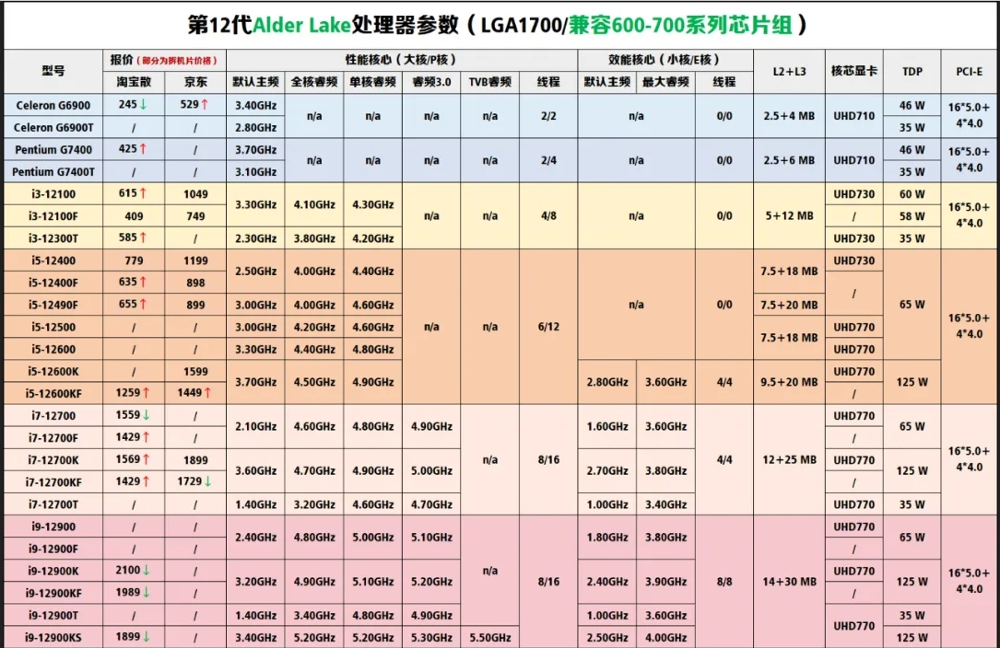

- 选购CPU或者其他硬件的时候都离不开以下几点。
    1. 确定需求：根据自己的需求选择自己合适的CPU，例如说你有游戏、剪辑、修图等就需要比较高性能的CPU。
    2. 确定预算：根据自己的需求选择合适的CPU，性能好的CPU通常也越贵。对于预算不是很足的同学来说可以选择从高销量高口碑的商家购买散片通常会比盒装版CPU便宜很多，但是售后通常都是店家保固。
    3. 兼容性：确保所选的CPU要和主板相互兼容， 包括插槽的类型（LGA 1700、AM4等等）和芯片组，主板后续会再介绍。如果想省时间可以购买板U套餐（CPU主板捆绑销售）。
    4. 功耗和散热：性能强的CPU需要更好的散热器来去推动，后续会再介绍散热对性能的影响。

#### CPU的组装

可以先看视频的介绍后续可以带你们实操。

##### Intel CPU安装

【【装机教程P3】intel CPU的安装方法】 https://www.bilibili.com/video/BV1Ue4y1T7KD/?share_source=copy_web&vd_source=141efb301e87945ebfb614f57c347f88
<iframe src="//player.bilibili.com/player.html?isOutside=true&aid=648624234&bvid=BV1Ue4y1T7KD&cid=918302942&p=1&autoplay=0" scrolling="no" border="0" frameborder="no" framespacing="0" allowfullscreen="true"></iframe>

##### AMD CPU安装

【【装机教程P2】AMD CPU的安装方法】 https://www.bilibili.com/video/BV1hg411J7Zv/?share_source=copy_web&vd_source=141efb301e87945ebfb614f57c347f88

<iframe src="//player.bilibili.com/player.html?isOutside=true&aid=518541177&bvid=BV1hg411J7Zv&cid=918301379&p=1&autoplay=0" scrolling="no" border="0" frameborder="no" framespacing="0" allowfullscreen="true"></iframe>

---
   
### 内存（RAM）

- 内存第一个作用是用来暂存处理器（CPU）的运算数据，不管是正在处理，还是将要处理，亦或者是处理完成的数据，都会同时存在于内存里。

- 第二个作用是和固态硬盘、机械硬盘等外部存储器交换数据。内存就好比中转站一样拿来暂时保存这些要用到的数据，因为CPU处理的速度太快，而外存的速度对于CPU来说很慢为了提高工作效率就拿内存来做之间沟通的桥梁。

想要了解内存的性能参数同样我们可以用[CPU-Z](https://www.cpuid.com/softwares/cpu-z.html)中的**内存一栏**来查询。

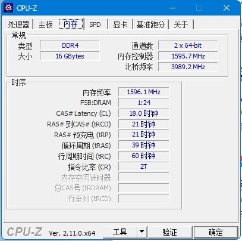

以及用**SPD（串行存在检测）**一栏用来保存一些厂商内存频率、CL值等等的预设的后面会再介绍。我们可以用这一栏看我们主板上的插槽所对应的内存参数

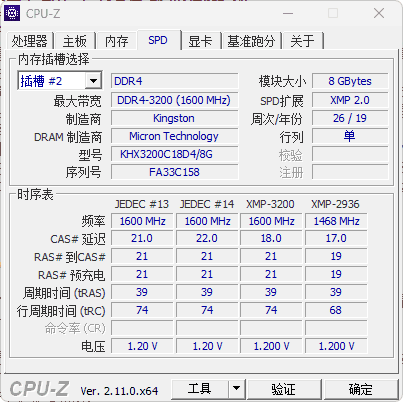

可以看到我这里在插槽2与4查了两根DDR4 8G 3200Mhz的内存，还有两个插槽是空的。由此可以看得出你内存的可用插槽有多少，方便后续升级。

#### 内存？外存？

- 相信仍然有很多同学容易混淆这两者，内存指的是随机存储器，断电后会丢失数据，作为CPU与外存沟通之间的桥梁。我们可以简单的用任务管理器去查看内存的简要信息。
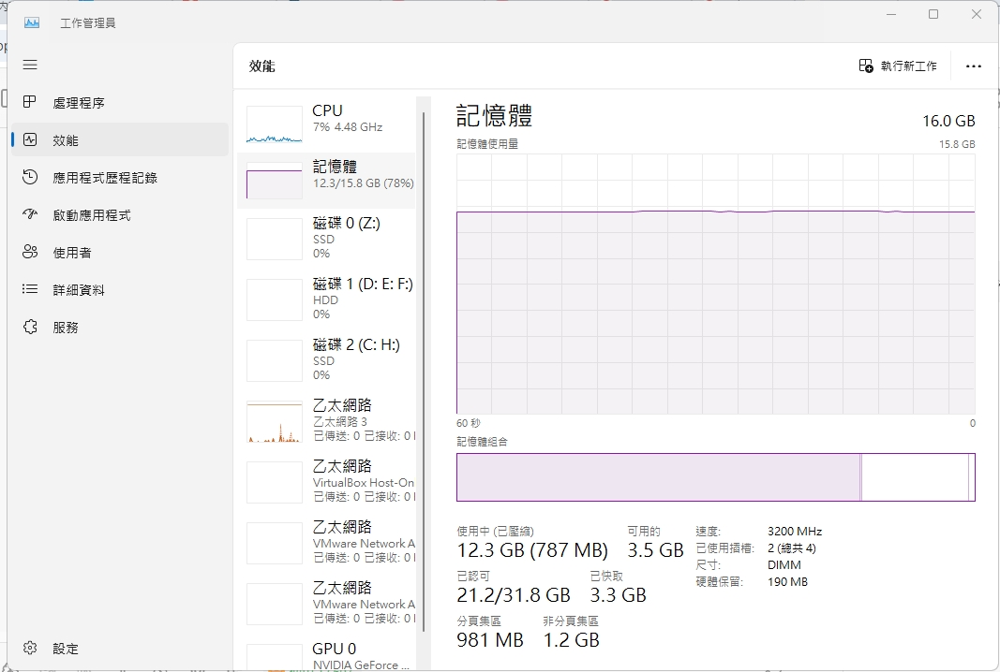

- 外存又名存储是真正可以拿来长期保存数据的容器，就是我们常说的固态硬盘、机械硬盘、软盘等等。
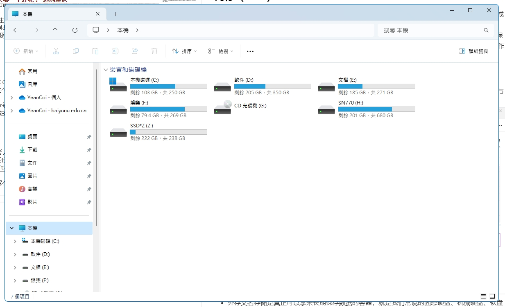

#### 内存的性能参数

内存的主要参数有DDR几、容量、频率、接口和内存时序。以我的内存为例`DDR4 16G 3200Mhz CL18`。

##### DDR

- 同样我们用的内存也经过了很多次改良迭代，包括DDR、DDR2、DDR3、DDR4和最新的DDR5。每一代DDR内存都提供了更高的频率和更低的功耗，从而提高了计算机的性能。

那么有什么区别呢？

1. 每一代内存的缺口处位置都不同（我们常称防呆控孔）
  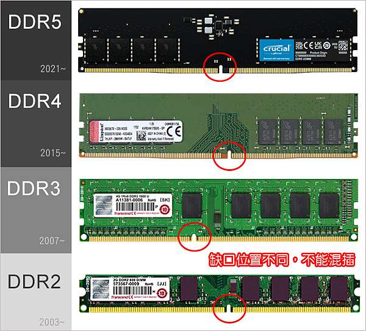
2. 降低的电压、延迟，提高频率、带宽
  - DDR：第一代DDR内存，频率通常在200MHz左右。（已淘汰）
    DDR2：第二代DDR内存，频率通常在400MHz左右，并引入了更低的电压。（已淘汰）
    DDR3：第三代DDR内存，频率通常在800MHz以上，并进一步降低了电压。（已淘汰很少见）
    DDR4：第四代DDR内存，频率通常在1600MHz以上，并继续降低电压。（主流）
    DDR5：第五代DDR内存，频率通常在3200MHz以上，并引入了新的内存架构和更高的带宽。（未来主流）

###### DDR4对比DDR5的拓展学习

- 这里我们只对DDR1、2、3代作为了解，主流的DDR4、DDR5才是我们接触最多的。

【最新的DDR5内存比DDR4强多少？单条真的是双通道吗？【翼王】】 https://www.bilibili.com/video/BV1TS4y1N7ee/?share_source=copy_web&vd_source=141efb301e87945ebfb614f57c347f88

<iframe src="//player.bilibili.com/player.html?isOutside=true&aid=683135076&bvid=BV1TS4y1N7ee&cid=574672119&p=1&autoplay=0" scrolling="no" border="0" frameborder="no" framespacing="0" allowfullscreen="true"></iframe>

【不是贵的才是对的 DDR5 VS DDR4内存超频游戏测试 20款游戏3种分辨率告诉你搭配12代酷睿内存超频能为游戏带来多少提升？】 https://www.bilibili.com/video/BV1Gr4y1i7vN/?share_source=copy_web&vd_source=141efb301e87945ebfb614f57c347f88

<iframe src="//player.bilibili.com/player.html?isOutside=true&aid=765692442&bvid=BV1Gr4y1i7vN&cid=484686310&p=1&autoplay=0" scrolling="no" border="0" frameborder="no" framespacing="0" allowfullscreen="true"></iframe>

---

##### 容量

顾名思义越大越好，当然也就越贵，内存的大小会直接影响系统的整体性能，对于计算机的专业的同学来说使用`windows 11`的操作系统，考虑到后续你们要玩虚拟机、要修图、要剪辑什么的，我会推荐你们买16G以上的内存（8Gx2组双通道或以上）。

- 可以用`CPU-Z的SPD`来查询你电脑有几个插槽。
- 在CMD下查询主板最大内存支持，具体操作如下：
  1. 在电脑Win+R键呼出运行，输入`cmd`回车；
  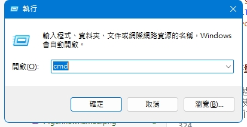
  1. 敲入`wmic memphysical get maxcapacity` 得到的是以KB为单位
   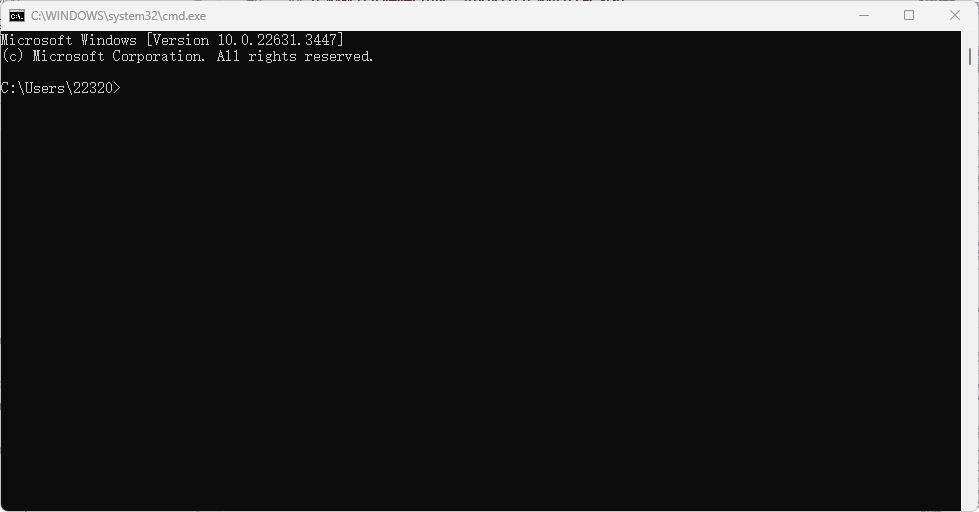
  2. 例如我这里的是134217728KB把它转换成GB就是134217728/1024得到MB再/1024得到128GB，那就是说我电脑主板支持的最大容量是128GB。

##### 通道数
- 单条32G是不是一定比16G（8Gx2）快？，如果是相同频率，和延迟的情况下，论容量而言32G可以同时放入更多的需要被加载的数据到内存。但是单通道（64bit）和双通道（128\~256bit），双通道可以完整的让CPU的发挥出它该有的性能，理论上是有2\~4倍的性能提升，所以我更推荐你们组双通道，容量够用就好了。

###### 通道数的拓展学习

【【硬核科普】为什么买内存推荐买8GX2而不是16GX1？详解内存双通道工作原理与作用】 https://www.bilibili.com/video/BV1UJ411B7mD/?share_source=copy_web&vd_source=141efb301e87945ebfb614f57c347f88

<iframe src="//player.bilibili.com/player.html?isOutside=true&aid=77644266&bvid=BV1UJ411B7mD&cid=132824884&p=1&autoplay=0" scrolling="no" border="0" frameborder="no" framespacing="0" allowfullscreen="true"></iframe>

###### 怎么看自己是不是双通道？

- 我们可以用`CPU-Z`内存栏查看，例如我的电脑就是跑在2x64bit=128bit的双通道下，单通道就显示1x64bit或者直接就是64bit。
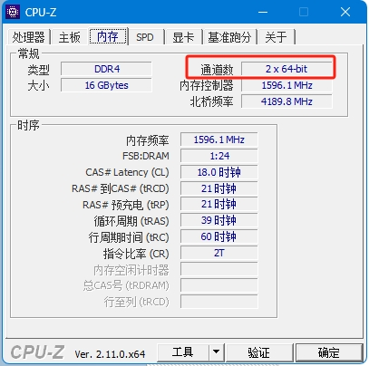

###### 主板上那么多插槽怎么插才能组双通道呢？

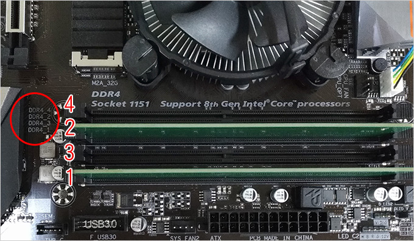

- 要插双通道就得要准备好两条最好是同型号同参数的内存，不同的参数可能会出问题。
- 如果要插双通道，通常都是插1-2插槽或者3-4插槽这样插。
  

**需要注意的是**：
1. 那我插满4个不就4通道，速度飞起？当然不是我们普通家用机最大只支持双通道而四通道在工作站级别才有，工作站主板通常有八个内存插槽四个通道数，PCI总线也更多等等，当然价格也更贵。
2. 不同主板的最推荐的插法不一，请按照主板的说明来插是最佳的。例如以下图片的主板。

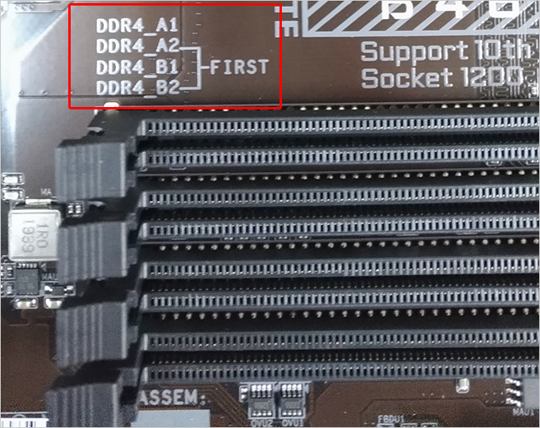

- 关于安装双通道的拓展学习
  【【硬核科普】为什么装机内存条推荐安装到第24槽而不是13槽？为什么ITX主板超频内存更容易？】 https://www.bilibili.com/video/BV19A411a7sC/?share_source=copy_web&vd_source=141efb301e87945ebfb614f57c347f88

  <iframe src="//player.bilibili.com/player.html?isOutside=true&aid=329013033&bvid=BV19A411a7sC&cid=217206371&p=1&autoplay=0" scrolling="no" border="0" frameborder="no" framespacing="0" allowfullscreen="true"></iframe>

---

##### 内存频率
- 内存频率是指内存模块的工作频率，通常以MHz（兆赫兹）为单位。内存频率越高，数据传输速率越快，从而提高计算机的运行速度。内存频率通常与CPU和主板兼容，选择合适的内存频率可以确保系统的稳定运行。

##### JEDEC频率与XMP

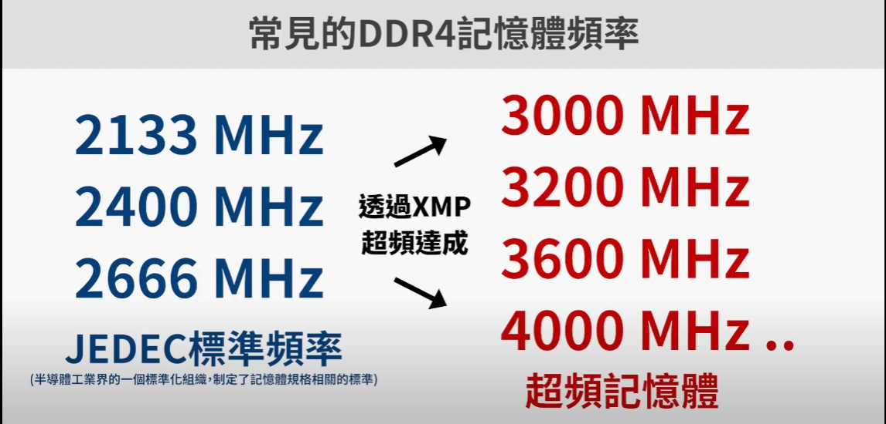

像是非JEDEC标准频率的内存都是厂商超频的内存需要在BIOS里面开启XMP才可以达到厂商所标称的内存频率。
需要注意的是需要主板支持XMP内存超频的功能。

- XMP的拓展学习
【【硬核科普】高频内存为什么一定要打开XMP？详解内存条的SPD与XMP】 https://www.bilibili.com/video/BV1r54y1r7Tf/?share_source=copy_web&vd_source=141efb301e87945ebfb614f57c347f88

<iframe src="//player.bilibili.com/player.html?isOutside=true&aid=842674996&bvid=BV1r54y1r7Tf&cid=252473424&p=1&autoplay=0" scrolling="no" border="0" frameborder="no" framespacing="0" allowfullscreen="true"></iframe>
  

###### 如何开启XMP？-初识BIOS
- 开启XMP通常需要进入BIOS设置，找到内存设置选项，然后选择XMP或Extreme Memory Profile选项，并选择相应的配置文件。不同的主板和BIOS版本可能有不同的设置方式，建议参考主板说明书或官方网站的说明。
1. 进入BIOS：重启计算机，在启动过程中按下BIOS设置键（通常是DEL、F2或F10键）。
找到内存设置选项 ：在BIOS设置中找到内存设置选项，通常位于“Advanced”或“Chipset”菜单下。
2. 选择XMP或Extreme Memory Profile选项 ：在内存设置选项中，找到XMP或Extreme Memory Profile选项，并选择相应的配置文件。
保存设置并退出BIOS：保存设置并退出BIOS，计算机将自动应用XMP配置。

###### BIOS的拓展学习-重要！
【学习重灌/超频之前 先来认识BIOS吧! UEFI 又是什么? | 聊电Jing】 https://www.bilibili.com/video/BV11W411m7gS/?share_source=copy_web&vd_source=141efb301e87945ebfb614f57c347f88

<iframe src="//player.bilibili.com/player.html?isOutside=true&aid=32870815&bvid=BV11W411m7gS&cid=57521927&p=1&autoplay=0" scrolling="no" border="0" frameborder="no" framespacing="0" allowfullscreen="true"></iframe>

【97%使用者可能会用到的6个BIOS功能! 华硕 微星 技嘉 BIOS 使用全指南! | 聊电Jing】 https://www.bilibili.com/video/BV1jb411A76B/?share_source=copy_web&vd_source=141efb301e87945ebfb614f57c347f88

<iframe src="//player.bilibili.com/player.html?isOutside=true&aid=35364008&bvid=BV1jb411A76B&cid=61985069&p=1&autoplay=0" scrolling="no" border="0" frameborder="no" framespacing="0" allowfullscreen="true"></iframe>

影片第15分钟会介绍XMP怎么开启建议全看完。

 ##### 延迟(CL值)
- CL（CAS Latency，列地址选通延迟）是内存时序中的一个重要参数，它表示内存模块在接收到列地址后，需要等待多少个时钟周期才能开始读取数据。CL值越低，内存的访问速度越快，从而提高计算机的性能。

##### CL值与频率的联系
- 若有两个内存，要怎么知道这两者哪个性能更好呢？
1. DDR4 8G 3200Mhz CL16
2. DDR4 8G 3600Mhz CL17

我们可以引入计算真实延迟的公式：

<math xmlns="http://www.w3.org/1998/Math/MathML" display="block"><mo>真实延迟时间</mo><mo stretchy="false">(</mo><mi>n</mi><mi>s</mi><mo stretchy="false">)</mo><mo>=</mo><mi>C</mi><mi>L</mi><mo>值</mo><mrow><mo>/</mo></mrow><mo>频率</mo><mo>∗</mo><mn>2000</mn></math>

`DDR4 8G 3200Mhz CL16`套入上面公式，我们计算出真实延迟是10ns。
而`DDR4 8G 3600Mhz CL17`计算出来的真实延迟是9.4ns。
由此得出延迟低的`DDR4 8G 3600Mhz CL17`性能是要优于`DDR4 8G 3200Mhz CL16`的。
大家可以上jd或者淘宝多练习计算。

- 其他更多关于内存延迟的参数可以自行去研究。

【超频内存前必看! 频率与时序的关系? 原来可以用公式计算!】 https://www.bilibili.com/video/BV1Wt411s7Zt/?share_source=copy_web&vd_source=141efb301e87945ebfb614f57c347f88

<iframe src="//player.bilibili.com/player.html?isOutside=true&aid=40256684&bvid=BV1Wt411s7Zt&cid=70703127&p=1&autoplay=0" scrolling="no" border="0" frameborder="no" framespacing="0" allowfullscreen="true"></iframe>

##### 内存-选购建议
- 一样都是可以看[电脑吧公众号](#市场上充斥着各种各样的CPU买哪一个好呢？-选购建议)来去选购

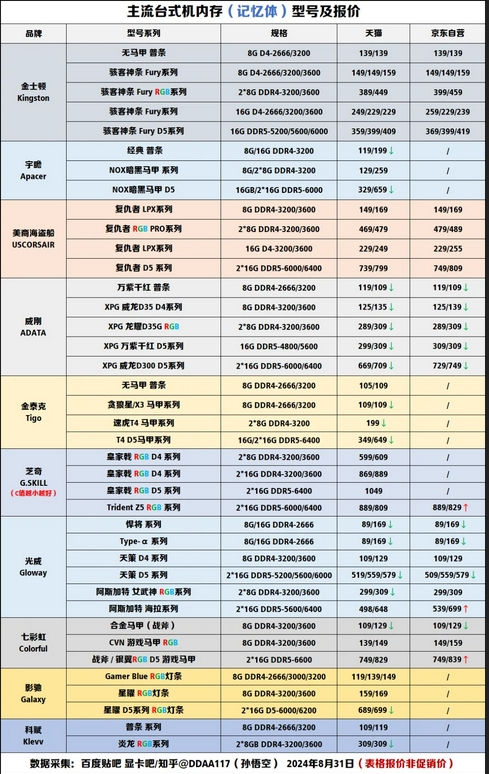

确定需求 ：根据需求选择合适的内存容量和频率。计算机专业的同学推荐选到16G以上，频率在兼容性和预算综合考虑最佳即可。
兼容性 ：确保所选内存与主板兼容，包括内存类型和插槽类型。
**需要注意的是**：如果买高频内存请确保你的主板支持XMP功能且与CPU等级挂钩。可以上主板官网去查询，例如[MAG B460 TOMAHAWK](https://tw.msi.com/Motherboard/MAG-B460-TOMAHAWK/Specification)。
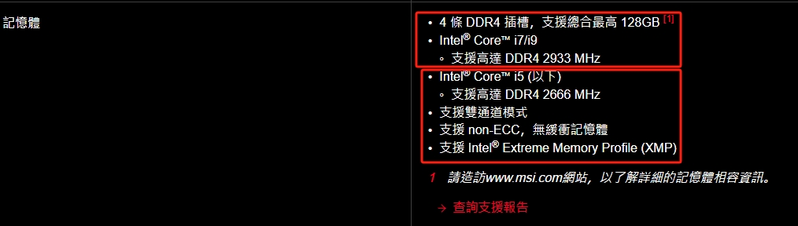
若我用I7/I9级别的那我XMP最高可以开到2933Mhz，同理我用i5以下的就最高只能到2666Mhz。

##### 内存条的安装

【【装机教程P4】内存条的安装方法】 https://www.bilibili.com/video/BV1fD4y1h7aK/?share_source=copy_web&vd_source=141efb301e87945ebfb614f57c347f88

<iframe src="//player.bilibili.com/player.html?isOutside=true&aid=733545707&bvid=BV1fD4y1h7aK&cid=918305407&p=1&autoplay=0" scrolling="no" border="0" frameborder="no" framespacing="0" allowfullscreen="true"></iframe>

